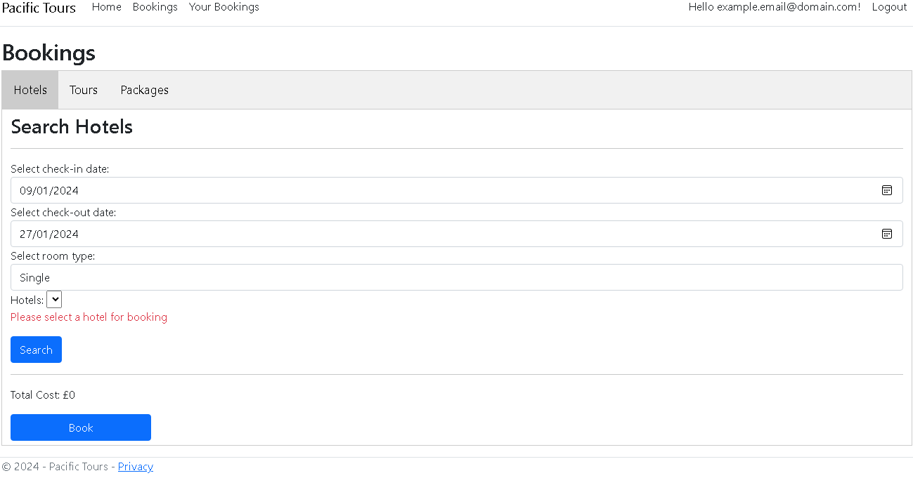
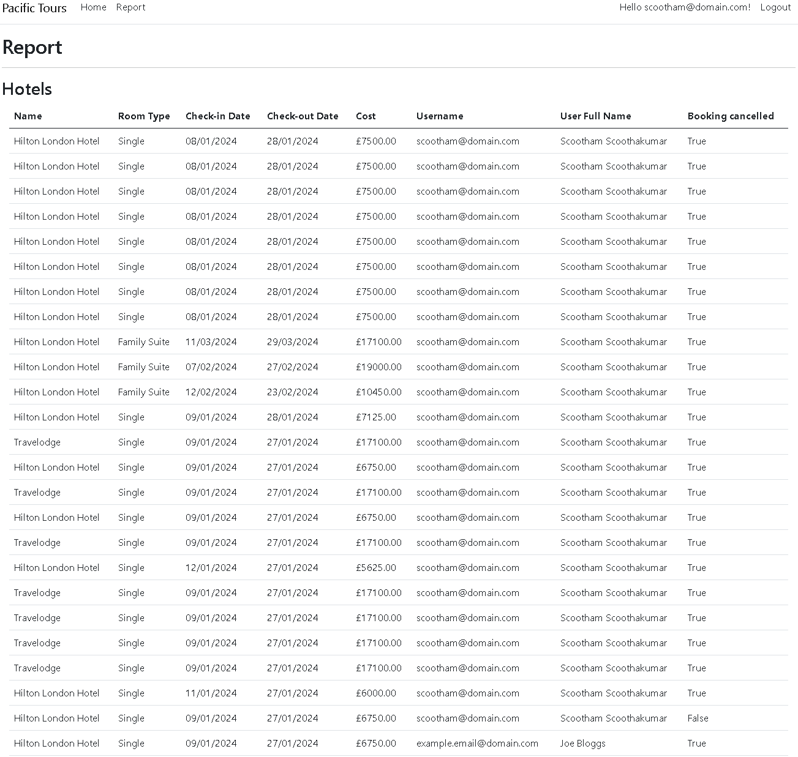

---

# 1 Introduction

This report documents the design, development, and implementation of a web-based reservation system for the company, Pacific Tours. The project aims to create a website that enables customers to search and book various hotel accommodations and tourd that are offered by the company.

The main requirements for this system are as follows:

- Customer registration and login
- Booking hotels, tours, and packages (a combination of both a hotel and a tour)
- Offering discounts based on booked packages
- Managing booking cancellations and modifications
- Generating booking summaries and availability reports for managers

# 2 System design and development approach

To meet the outlined requirements, an agile approach was taken.

## 2.1 Agile software development methodology

The iterative approach to developing software has been highly beneficial to programmers to improve their skills and organisations in estimating the necessary timespan required for certain tasks [@edeki2015]. Its traits of flexibility, a clear-defined scope of requirements, quick adaptability as well and pragmatism to deliverables make it suitable for developing software [@brush2022].

Agile programming utilises the idea of sprints, which are iterative cycles whereby a functionality is taken and developed to produce small increments. Each sprint follows the typical developmental phases, as seen in more traditional software methodologies such as the waterfall method. These phases include requirements, analysis, design, evolution, and delivery [@abrahamsson2017].

## 2.2 Agile application and design considerations

For this specific scenario, however, an agile methodology was adopted with sprints each lasting 2-weeks. This timeframe proved to be adequate for implementing, demonstrating, and conducting robust testing. Rather than delivering all the requirements at once, it was beneficial to abstract and break the overall scenario down into key components.

Throughout, the goal was to promote code that is maintainable, extendable, and also secure. This can be achieved through best coding practices such as:

- Using dependency injection for loose coupling.
- Implementing input validation for all forms.
- Ensuring database parameters are properly formatted, i.e. sanitised.

The sprints were broken down into the following:

### 2.2.1 Sprint 1

| Tasks                                                                        | Interpretation                                                                                                            |
| ---------------------------------------------------------------------------- | ------------------------------------------------------------------------------------------------------------------------- |
| Choosing suitable web technologies                                           | ASP.NET C# with both client and server side combined                                                                      |
| Setting up development environment                                           | Adequate system resources for high performance, Windows 10 OS, Microsoft SQL Management Studio, stable network connection |
| Familiarising with technologies by developing small Proof of Concepts (POCs) | Experiment with Blazor WebAssembly, ASP.NET default scaffolded classes etc.                                               |
| Deciding the project structure and architecture                              | Single ASP.NET Core Web application with folders for Pages, Services, Exceptions, Models                                  |

### 2.2.2 Sprint 2

| Tasks                              | Interpretation                                                                                  |
| ---------------------------------- | ----------------------------------------------------------------------------------------------- |
| Setup version control system       | Using a private GitHub repository                                                               |
| Configure SQL database settings    | Using Microsoft SQL Management Studio, database context class, Entity Framework Core Migrations |
| Integrate user model               | Using Entity Framework Core Identity, ApplicationUser model                                     |
| Add registration, login and logout | Using ASP.NET scaffolding for default registration, login and logout pages and functionality    |

### 2.2.3 Sprint 3

| Tasks                                                       | Interpretation                                                                                               |
| ----------------------------------------------------------- | ------------------------------------------------------------------------------------------------------------ |
| Decide on database entities                                 | Such Hotels, Tours, Availabilities, etc.                                                                     |
| Discern entity relations between tables                     | Mostly one-to-many/many-to-one with a few one-to-one                                                         |
| Test SQL database and interact with it via code             | Use Entity Framework Core Migrations to update database and use data context class to facilitate interaction |
| Draft the UI for any required pages and their functionality | Such as Bookings, Edit Bookings, View Bookings and so on                                                     |

### 2.2.4 Sprint 4

| Tasks                                      | Interpretation                                                                                                |
| ------------------------------------------ | ------------------------------------------------------------------------------------------------------------- |
| Implement Bookings page UI                 | Tab based UI for Hotels, Tours and Packages with relevant form details                                        |
| Implement Bookings functionality           | Configure database queries and write to database                                                              |
| Implement View Bookings page UI            | Table based UI for Hotels, Tours and Packages with relevant details plus Edit and Cancel buttons              |
| Implement View Bookings functionality      | Hotels, Tours or Packages booked should be rendered to the page dynamically based on database state           |
| Implement Edit Bookings page UI            | Derive from Bookings page form UI for each Hotels, Tours and Packages                                         |
| Implement Edit Bookings page functionality | Redirect to relevant edit page on button click, search based on dates, update database and View Bookings page |

# 3 System functionality and features

## 3.1 Key requirement 1: Customer account management

This requirement encompasses user login, registration, logout, and their relevant UI counterparts, mainly through ASP.NET Identity dependencies and scaffolding.

First, looking at the `ApplicationUser` model:

```csharp
using Microsoft.AspNetCoreIdentity

namespace PacificTours.Models
{
    public class ApplicationUser : IdentityUser
    {
        public String FirstName { get; set; } = "";
        public String LastName { get; set; } = "";
        public String Address { get; set; } = "";
        public String PassportNumber { get; set; } = "";
        public DateTime CreatedAt { get; set; }
    }
}
```

This extends ASP.NET's in-built `IdentityUser`, meaning that additional properties vital to a user model, such as `PasswordHash`, `UserName`, `Email`, and `PhoneNumber` are already a part of that class by default and do not need to be redefined.

Next, using ASP.NET's scaffolding, automatic files for login (`Login.cshtml` and `Login.cshtml.cs`), files for registration (`Registration.cshtml` and `Registration.cshtml.cs`) as well as for logout (`Logout.cshtml` and `Logout.cshtml.cs`) are generated with their relevant logic in their `OnPostAsync` methods. Then based on the `.cshtml` form submit, the `OnPostAsync` function, checks the user using `SignInManager` class (for Login and Logout) and `UserManager` class (for Registration). For example, looking at the `Login.cshtml.cs`'s `OnPostAsync` method, first checks if the `ModelState` is valid. If so, it attempts to get the user using `PasswordSignInAsync` to find the user from the database and uses the `await` keyword since the function is of type `async`.

```C#
public async Task<IActionResult> OnPostAsync(string returnUrl = null)
        {
            returnUrl ??= Url.Content("~/");

            ExternalLogins = (await _signInManager.GetExternalAuthenticationSchemesAsync()).ToList();

            if (ModelState.IsValid)
            {
                var result = await _signInManager.PasswordSignInAsync(Input.Email, Input.Password, Input.RememberMe, lockoutOnFailure: false);
                if (result.Succeeded)
                {
                    _logger.LogInformation("User logged in.");
                    return LocalRedirect(returnUrl);
                }
                if (result.RequiresTwoFactor)
                {
                    return RedirectToPage("./LoginWith2fa", new { ReturnUrl = returnUrl, RememberMe = Input.RememberMe });
                }
                if (result.IsLockedOut)
                {
                    _logger.LogWarning("User account locked out.");
                    return RedirectToPage("./Lockout");
                }
                else
                {
                    ModelState.AddModelError(string.Empty, "Invalid login attempt.");
                    return Page();
                }
            }
```

An abstract explanation of these classes first defines the bind properties that link to the elements in the relevant `.cshtml` page via the `[BindProperty]` data annotation. Furthermore, the annotations for the properties in the `InputModel` class serve as input validation.

```C#
[BindProperty]
public InputModel Input { get; set; }

public class InputModel
        {
            [Required]
            [EmailAddress]
            public string Email { get; set; }

            [Required]
            [DataType(DataType.Password)]
            public string Password { get; set; }

            [Display(Name = "Remember me?")]
            public bool RememberMe { get; set; }
        }
```

For more detail see Appendix [5.2](#52-scaffolding-generated-files-for-user-account-management) for the content of all files relating to user account management.

## 3.2 Key requirement 2: Bookings

The requirement for this part of the scenario involves a single bookings page in which the user can either book a hotel, tour, or package (a combination of both a hotel and a tour). For this page, inspiration was taken from the Bookings.com UI – which features a tab-based system. The starting code for this was taken from W3Schools [@w3schools2024] (See Appendix [5.3.1](#531-w3schools-tab-based-ui)).

This UI however, has to be adapted for the Bookings system, since the default tab logic doesn't take into account the refresh on form submit, persistence of input box states, and so on. This whole host of issues involves additional JavaScript client-side validation that cannot be addressed by the server-side C# code alone.

Starting with the UI, the `asp-page-handler` attribute of the form element corresponds to `HotelSearch`, i.e. the correct `OnPostAsync` method in the server-side code. This also means that the URL will have a new query parameter, `handler=HotelSearch`, making it easy to distinguish what tab is being selected.

```html
<div asp-validation-summary="ModelOnly" class="text-danger" role="alert"></div>
<form id="hotelSearchForm" method="post" asp-page-handler="HotelSearch">
  <div id="Hotels" class="tabcontent">
    <h3>Search Hotels</h3>
    <hr />
    <div class="form-group">
      <label asp-for="HotelSearch.CheckInDate">Select check-in date:</label>
      <input
        id="hotelCheckInDate"
        asp-for="HotelSearch.CheckInDate"
        type="date"
        class="form-control"
      />
      <span
        asp-validation-for="HotelSearch.CheckInDate"
        class="text-danger"
      ></span>
    </div>
    <div class="form-group">
      <label asp-for="HotelSearch.CheckInDate">Select check-out date:</label>
      <input
        id="hotelCheckOutDate"
        asp-for="HotelSearch.CheckOutDate"
        type="date"
        class="form-control"
      />
      <span
        asp-validation-for="HotelSearch.CheckOutDate"
        class="text-danger"
      ></span>
    </div>
    <div class="form-group">
      <label asp-for="HotelSearch.RoomType">Select room type:</label>
      <select
        asp-for="HotelSearch.RoomType"
        asp-items="@Model.HotelSearch.RoomTypes"
        class="form-control"
      ></select>
      <span
        asp-validation-for="HotelSearch.RoomType"
        class="text-danger"
      ></span>
    </div>
    <div class="form-group">
      <label for="hotels">Hotels:</label>
      <select
        name="hotels"
        id="hotelsDropdown"
        onchange='calculateTotalCost("hotelsDropdown", "hotelCheckInDate", "hotelCheckOutDate", "hotelTotalCostMessage")'
      >
        @foreach (var hotel in Model.HotelSearch.HotelsList) {
        <option value="@hotel.HotelId">
          @(hotel.Name + " £" + hotel.Cost + " (per night)")
        </option>
        }
      </select>
      <p id="hotelsDropdownErrorMessage" class="text-danger"></p>
    </div>
    <div class="form-group">
      <input
        type="submit"
        name="command"
        class="btn btn-primary"
        value="Search"
      />
    </div>
    <hr />
    <p id="hotelTotalCostMessage">Total Cost: £0</p>
    <div class="form-group">
      <input
        class="btn btn-primary"
        name="command"
        value="Book"
        onclick="submitHotelSearchForm()"
      />
    </div>
  </div>
</form>
```

Here below, are the relevant JavaScript functions that are referenced in the code.

Since the `OnPostAsync` function reloads the page, using the page handler, this `switch` statement checks what form is being submitted and automatically selects the relevant tab as default with the `onClick()` method.

```Javascript
let params = new URL(document.location).searchParams;
let handler = params.get("handler");

switch (handler) {
  case "HotelSearch":
    document.getElementById("HotelTab").click();
    break;
  case "TourSearch":
    document.getElementById("TourTab").click();
    break;
  case "PackageBook":
    document.getElementById("PackageTab").click();
    break;
  default:
    break;
}
```

Here, this method checks whether the dropdown box is not empty and displays an appropriate error message by referencing a paragraph tag within the form. It only then submits the form dynamically if the `selectBoxValue` isn't null.

```Javascript
function submitHotelSearchForm() {
  var dropdownErrorMessage = document.getElementById(
    "hotelsDropdownErrorMessage"
  );
  dropdownErrorMessage.innerHTML = "";

  var form = document.getElementById("hotelSearchForm");
  var selectBoxValue = form.elements["hotelsDropdown"].value;

  if (!selectBoxValue) {
    dropdownErrorMessage.innerHTML = "Please select a hotel for booking";
    return;
  }

  form.elements["command"].value = "Book";
  form.submit();
}
```

The following series of functions are related to cost calculations for all three tabs.

The first function, `calculateTotal(dropdown, fromDate, toDate)`, extracts the cost value from the dropdown box and calculates the cost per night/day.

```Javascript
function calculateTotal(dropdown, fromDate, toDate) {
  var selectedDropdown = document.getElementById(dropdown);
  var selectedOption = selectedDropdown.options[selectedDropdown.selectedIndex];
  var cost = selectedOption.textContent.split(" £")[1].split(" ")[0];

  var startDate = new Date(document.getElementById(fromDate).value);
  var endDate = new Date(document.getElementById(toDate).value);

  var durationInDays = Math.ceil((endDate - startDate) / (1000 * 60 * 60 * 24));

  return parseFloat((cost * durationInDays).toFixed(2));
}

function calculateTotalCost(dropdown, fromDate, toDate, totalCostMessageId) {
  document.getElementById(totalCostMessageId).innerHTML =
    "Total Cost: £" + calculateTotal(dropdown, fromDate, toDate);
}
```

This next function, is specifically for calculating the total cost of a package since it contains both a tour and hotel. Since logic doesn't need to be repeated, it utilises the previous function to calculate cost.

```Javascript
function calculateTotalPackageCost() {
  var packageHotelCost = calculateTotal(
    "packageHotelsDropdownId",
    "packageHotelCheckInDate",
    "packageHotelCheckOutDate"
  );
  var packageTourCost = calculateTotal(
    "packageToursDropdownId",
    "packageTourStartDate",
    "packageTourEndDate"
  );

  var packageTotalCost = packageHotelCost + packageTourCost;

  document.getElementById("packageTotalCostMessage").innerHTML =
    "Total Cost: £" + packageTotalCost;
}
```

Finally, upon page reload, an attached event listener upon page reload will check which tab is active and apply the total cost calculation dynamically. This uses the `.className` attribute of the tab switching code.

```Javascript
window.addEventListener("load", function () {
  if (document.getElementById("HotelTab").className == "tablinks active") {
    calculateTotalCost(
      "hotelsDropdown",
      "hotelCheckInDate",
      "hotelCheckOutDate",
      "hotelTotalCostMessage"
    );
  } else if (
    document.getElementById("TourTab").className == "tablinks active"
  ) {
    calculateTotalCost(
      "toursDropdown",
      "tourStartDate",
      "tourEndDate",
      "tourTotalCostMessage"
    );
  } else if (
    document.getElementById("PackageTab").className == "tablinks active"
  ) {
    calculateTotalPackageCost();
  }
});
```

Taking the `OnPostHotelSearchAsync` function, it checks if the button clicked is search, via the `command` parameter. This references the `name=command` element for the search button on the client-side. Using the database context, it checks for all available hotels based on the user's dates and returns the found `Hotel` object. It then binds this into the `HotelList` to the client-side element.

```C#
if (command == "Search")
{
var availableHotels = await _dbContext.HotelAvailabilities
    .Where(ha =>
        ha.AvailableFrom <= HotelSearch.CheckInDate &&
        ha.AvailableTo >= HotelSearch.CheckOutDate &&
        ha.Hotel.RoomType == HotelSearch.RoomType)
    .Select(ha => ha.Hotel)
    .Distinct()
    .ToListAsync();

HotelSearch.HotelsList = availableHotels;

return Page();
```

However, in the else block, i.e. the "Book" button is clicked, a new hotel booking is made, referencing the `HotelBooking` model. This model takes in a unique ID, i.e. the HotelBookingId as a GUID data type, a reference to the `Hotel` that the user selected, the dates, and a reference to the current user (found via the `IdentityUser`'s `UserManager` class). It is then added to the `HotelBookings` table in the database. Finally, a redirection is made to the "/Payment" page with the booking ID and type of booking (hotel, tour, or package) as a query parameter in the URL. This is then extracted from the payments page for further use.

```C#
else
{
    var SelectedHotelId = new Guid(Request.Form["hotels"]);
    var CurrentUser = await _userManager.GetUserAsync(User);
    Hotel SelectedHotel = await _dbContext.Hotels.FindAsync(SelectedHotelId);

    var hotelBooking = new HotelBooking
    {
        HotelBookingId = new Guid(),
        HotelId = SelectedHotelId,
        UserId = CurrentUser.Id,
        CheckInDate = HotelSearch.CheckInDate,
        CheckOutDate = HotelSearch.CheckOutDate,
        Hotel = SelectedHotel,
        ApplicationUser = CurrentUser
    };

    _dbContext.HotelBookings.Add(hotelBooking);
    await _dbContext.SaveChangesAsync();

    return RedirectToPage("/Payment", new
    {
        bookingId = hotelBooking.HotelBookingId.ToString(),
        bookingType = "hotel"
    });
}
```

For more detail, see Appendix [5.3](#53-files-for-hotel-tour-and-package-bookings) for the content of all files relating to bookings.

## 3.3 Key requirement 3: View Bookings

For this requirement, any hotels, tours, or packages booked by the user should be displayed promptly after a successful payment. This page should hold the latest details of bookings, even if they are edited (see [3.4](#34-key-requirement-4-edit-bookings)).

Starting with the client-side code, again, just looking at the hotels should suffice since tours and packages follow the same logic.

Using in line C# in the `.cshtml` page, the rows can be dynamically updated via a `foreach` loop that iterated through a list of type `HotelBookings` that is populated dynamically in the server-side. The row for the hotel cost does a calculation, multiplying it by the duration of days. The duration being the difference between the `HotelBooking.CheckInDate` and the `HotelBooking.CheckOutDate`.

```html
<form id="hotelTableForm" method="post" asp-page-handler="HotelTable">
  <h3>Hotels</h3>
  <div class="container">
    <div class="row">
      <div class="col-md-12">
        <table class="table">
          <thead>
            <tr>
              <th>Name</th>
              <th>Room Type</th>
              <th>Check-in Date</th>
              <th>Check-out Date</th>
              <th>Cost</th>
            </tr>
          </thead>
          <tbody>
            <input
              type="hidden"
              id="hotelBookingIdInput"
              name="hotelBookingId"
              value=""
            />
            @foreach (var item in Model.ViewBookingsTable.HotelBookingsList) {
            <tr>
              <td>@item.Hotel.Name</td>
              <td>@item.Hotel.RoomType</td>
              <td>@item.CheckInDate.ToShortDateString()</td>
              <td>@item.CheckOutDate.ToShortDateString()</td>
              <td>
                @("£" + ((item.CheckOutDate - item.CheckInDate).Days *
                item.Hotel.Cost).ToString("0.00"))
              </td>
              <td>
                <div class="btn-group" role="group">
                  <input
                    type="submit"
                    class="btn btn-primary"
                    name="command"
                    value="Edit"
                    onclick="submitForm('hotelBookingIdInput', 'hotelTableForm', '@item.HotelBookingId')"
                  />
                </div>
                <div class="btn-group" role="group">
                  <input
                    type="submit"
                    class="btn btn-danger"
                    name="command"
                    value="Cancel"
                    onclick="onCancelClick('hotelBookingIdInput', 'hotelTableForm', '@item.HotelBookingId')"
                  />
                </div>
              </td>
            </tr>
            }
          </tbody>
        </table>
      </div>
    </div>
  </div>
</form>
```

For each table entry, there are two additional buttons. One for editing and the other for the cancellation of bookings. These buttons are bound to the below JavaScript functions. Upon the cancellation button, a dialog box appears asking the user for confirmation. It then submits the form via the `submitForm` function.

```Javascript
function onCancelClick(bookingInputId, submitFormId, bookingId) {
  var isConfirmed = window.confirm(
    "Are you sure you want to cancel your booking?"
  );

  if (isConfirmed) {
    submitForm(bookingInputId, submitFormId, bookingId);
  }
}

function submitForm(bookingInputId, submitFormId, bookingId) {
  var form = document.getElementById(submitFormId);
  document.getElementById(bookingInputId).value = bookingId;
  form.submit();
}
```

First, the ID of the current user is required, and using this, a query to the database is made to retrieve all relevant bookings. The variable which are bound to the client side take on the value of these variables so that it can be displayed. Finally, the `successMessage` element takes on the query parameter in the URL from the payments page providing user feedback.

```C#
public async Task<IActionResult> OnGet()
{
    var CurrentUser = await _userManager.GetUserAsync(User);

    var hotelBookingsList = await _dbContext.HotelBookings
        .Where(hb => hb.UserId.Equals(CurrentUser.Id) && hb.IsCancelled == false)
        .Include(hb => hb.Hotel)
        .ToListAsync();

    ViewBookingsTable.HotelBookingsList = hotelBookingsList;

    var tourBookingsList = await _dbContext.TourBookings
        .Where(tb => tb.UserId.Equals(CurrentUser.Id) && tb.IsCancelled == false)
        .Include(tb => tb.Tour)
        .ToListAsync();

    ViewBookingsTable.TourBookingsList = tourBookingsList;

    var packageBookingsList = await _dbContext.PackageBookings
        .Where(pb => pb.UserId.Equals(CurrentUser.Id) && pb.IsCancelled == false)
        .Include(pb => pb.Hotel)
        .Include(pb => pb.Tour)
        .ToListAsync();

    ViewBookingsTable.PackageBookingsList = packageBookingsList;

    ViewBookingsTable.SuccessMessage = Request.Query["successMessage"];

    return Page();
}
```

Each table in the ViewBookings page has its own `PostAsync` function with the same logic as demonstrated below. It first attempts to take the `HotelBookingId` from the client-side form to make a request to the database to retrieve the correct `HotelBooking`. The `IsCancelled` property is set to the boolean value of `true` and the page redirects to "/ViewBookings". However if the "Edit" button is clicked, it redirects to the appropriate EditBooking page (see [3.4](#34-key-requirement-4-edit-bookings)) and passes the appropriate `HotelBookingId` as a URL query parameter.

It is important to note that the bookings have an `IsCancelled` property. This means that soft deletion is implemented, rather than physical record deletion, in order to avoid database problems. A downside of this however, is that the database size can increase exponentially over time, but it is the trade off taken to maintain a secure database.

```C#
public async Task<IActionResult> OnPostHotelTableAsync(string command, string returnUrl = null)
{
    if (command == "Cancel")
    {
        var HotelBookingId = new Guid(Request.Form["hotelBookingId"]);

        var hotelBooking = await _dbContext.HotelBookings
            .Where(hb => hb.HotelBookingId == HotelBookingId)
            .FirstOrDefaultAsync();

        hotelBooking.IsCancelled = true;

        await _dbContext.SaveChangesAsync();

        return RedirectToPage("/ViewBookings");
    }
    else
    {
        return RedirectToPage("/EditHotelBooking", new
        {
            hotelBookingId = Request.Form["hotelBookingId"]
        });
    }
}
```

For more detail, see Appendix [5.4](#54-files-for-view-bookings) for the content of all files relating to view bookings.

## 3.4 Key requirement 4: Edit Bookings

This requirement entails implementing a modification form for any existing bookings. Upon the "Edit" button click, they should be redirected to the appropriate edit form, and upon modification, the "ViewBookings" page with the new information.

The form below is simple and self-explanatory, with just the required input values. One thing however is that the modification of the user's room type and choice of hotel has been disabled. This assumption has been taken under the consideration of the business limits, in which they can only accommodate the modification of the check-in and check-out dates.

```html
<h2>Edit Hotel Booking</h2>
<div asp-validation-summary="ModelOnly" class="text-danger" role="alert"></div>
<form id="hotelSearchForm" method="post">
  <input
    type="hidden"
    asp-for="EditBooking.HotelBookingId"
    value="@Model.EditBooking.HotelBookingId"
  />
  <hr />
  <div class="form-group">
    <label asp-for="EditBooking.CheckInDate">Select check-in date:</label>
    <input asp-for="EditBooking.CheckInDate" type="date" class="form-control"
    value="@Model.EditBooking.CheckInDate.ToString("yyyy-MM-dd")" />
    <span
      asp-validation-for="EditBooking.CheckInDate"
      class="text-danger"
    ></span>
  </div>
  <div class="form-group">
    <label asp-for="EditBooking.CheckInDate">Select check-out date:</label>
    <input asp-for="EditBooking.CheckOutDate" type="date" class="form-control"
    value="@Model.EditBooking.CheckOutDate.ToString("yyyy-MM-dd")" />
    <span
      asp-validation-for="EditBooking.CheckOutDate"
      class="text-danger"
    ></span>
  </div>
  <div class="form-group">
    <label>Room type:</label>
    <input type="text" value="@Model.EditBooking.RoomType" disabled />
  </div>
  <div class="form-group">
    <label>Hotel:</label>
    <input
      type="text"
      value="@Model.EditBooking.HotelsList.First().Name"
      disabled
    />
  </div>
  <p class="text-danger">@Model.EditBooking.ErrorMessage</p>
  <div class="form-group">
    <input
      type="submit"
      class="btn btn-primary"
      name="command"
      value="Modify"
    />
  </div>
</form>
```

Here, when the page loads, the `OnGet` method attempts to take the `hotelBookingId` from the URL query parameter. After converting that to a GUID, it then attempts to find the relevant `Hotel` object based on that ID via getting the relevant `HotelBooking` record. From that, it pre-populates the form with the existing `HotelBooking`.

```C#
public async Task<IActionResult> OnGet()
{
    var HotelBookingIdValue = Request.Query["hotelBookingId"];
    var HotelBookingId = new Guid(HotelBookingIdValue.ToString());

    var hotelBooking = await _dbContext.HotelBookings
        .Where(hb => hb.HotelBookingId == HotelBookingId)
        .Include(hb => hb.Hotel)
        .FirstOrDefaultAsync();

    EditBooking.CheckInDate = hotelBooking.CheckInDate;
    EditBooking.CheckOutDate = hotelBooking.CheckOutDate;
    EditBooking.RoomType = hotelBooking.Hotel.RoomType;
    EditBooking.HotelsList.Add(hotelBooking.Hotel);

    EditBooking.HotelBookingId = HotelBookingIdValue;

    return Page();
}
```

When the form is submitted, the `OnPostAsync` function, aims to get the `HotelBookingId` via the URL query parameter, and converts that to a GUID. Using that, it retrieves the relevant `HotelBooking` record's `Hotel` object. It then attempts to find that specific hotel's availability and returns that `Hotel` object. In the case when the `HotelAvailability` list is populated with at least one item, i.e. a hotel with that availability, it then updates the `CheckInDate` and `CheckOutDate` of that record. Upon modification, a page redirection is made to "/Payments", where the booking ID along with the entity type is passed via the URL query parameter. If the `HotelAvailability` variable is zero, then an error message is displayed.

```C#
public async Task<IActionResult> OnPostAsync(string returnUrl = null)
{
    EditBooking.ErrorMessage = null;

    var HotelBookingIdValue = Request.Query["hotelBookingId"];
    var HotelBookingId = new Guid(HotelBookingIdValue.ToString());

    var HotelBooking = await _dbContext.HotelBookings
        .Where(hb => hb.HotelBookingId == HotelBookingId)
        .Include(hb => hb.Hotel)
        .FirstOrDefaultAsync();

    var CurrentUser = await _userManager.GetUserAsync(User);

    var HotelAvailability = await _dbContext.HotelAvailabilities
        .Where(ha =>
            ha.HotelId == HotelBooking.HotelId &&
            ha.AvailableFrom <= EditBooking.CheckInDate &&
            ha.AvailableTo >= EditBooking.CheckOutDate)
        .Select(ha => ha.Hotel)
        .Distinct()
        .ToListAsync();

    if (HotelAvailability.Count == 1)
    {
        HotelBooking.CheckInDate = EditBooking.CheckInDate;
        HotelBooking.CheckOutDate = EditBooking.CheckOutDate;

        _dbContext.HotelBookings.Update(HotelBooking);
        await _dbContext.SaveChangesAsync();

        return RedirectToPage("/Payment", new
        {
            bookingId = HotelBookingIdValue,
            bookingType = "hotel"
        });
    }
    else
    {
        EditBooking.ErrorMessage = "Hotels not available for selected dates";

        EditBooking.HotelsList.Add(HotelBooking.Hotel);
        EditBooking.CheckInDate = EditBooking.CheckInDate;
        EditBooking.CheckOutDate = EditBooking.CheckOutDate;
        EditBooking.RoomType = HotelBooking.Hotel.RoomType;

        return Page();
    }
}
```

For more detail, see Appendix ([5.5](#55-files-for-edit-bookings)) for the content of all files relating to edit bookings.

## 3.5 Key requirement 5: Manager role and Bookings Report Display

For this requirement, user roles needed to be considered, and this can easily be implemented via ASP.NET Identity Framework. Within these lines, a `client`, for normal application users, and `manager`, for managerial use, have been established via ASP.NET Identity Roles in the `ApplicationDbContext` class.

```C#
var manager = new IdentityRole("manager");
manager.NormalizedName = "manager";

var client = new IdentityRole("client");
client.NormalizedName = "client";

modelBuilder.Entity<IdentityRole>().HasData(manager, client);
```

However, these need to be instantiated and configured within the `Program.cs` file. Here, policies are created within the `AddAuthorization` service, where the roles are references to the respective policy. Furthermore, when the `ApplicationUser` is added as a type in `AddDefaultIdentity`, the Identity Roles are additionally referenced.

```C#
builder.Services.AddAuthentication();

builder.Services.AddAuthorization(options =>
{
    options.AddPolicy("RequireAdmin", policy => policy.RequireRole("manager"));
    options.AddPolicy("RequireManager", policy => policy.RequireRole("client"));
});

builder.Services.AddDefaultIdentity<ApplicationUser>(options =>
    options.SignIn.RequireConfirmedAccount = false)
    .AddRoles<IdentityRole>()
    .AddEntityFrameworkStores<ApplicationDbContext>();
```

The manager's report dashboard is heavily inspired by the "ViewBookings" page to use a table format. Here additional columns have been included to give insight into user details via their full name, username, and whether that particular booking has been cancelled.

```html
<h3>Hotels</h3>
<div class="container">
  <div class="row">
    <div class="col-md-12">
      <table class="table">
        <thead>
          <tr>
            <th>Name</th>
            <th>Room Type</th>
            <th>Check-in Date</th>
            <th>Check-out Date</th>
            <th>Cost</th>
            <th>Username</th>
            <th>User Full Name</th>
            <th>Booking cancelled</th>
          </tr>
        </thead>
        <tbody>
          @foreach (var item in Model.ReportTable.HotelBookingsList) {
          <tr>
            <td>@item.Hotel.Name</td>
            <td>@item.Hotel.RoomType</td>
            <td>@item.CheckInDate.ToShortDateString()</td>
            <td>@item.CheckOutDate.ToShortDateString()</td>
            <td>
              @("£" + ((item.CheckOutDate - item.CheckInDate).Days *
              item.Hotel.Cost).ToString("0.00"))
            </td>
            <td>@item.ApplicationUser.UserName</td>
            <td>
              @(item.ApplicationUser.FirstName + " " +
              item.ApplicationUser.LastName)
            </td>
            <td>@item.IsCancelled</td>
          </tr>
          }
        </tbody>
      </table>
    </div>
  </div>
</div>
```

However, the "ViewBookings" page's server-side code has to be modified. In addition to including the entity of either `Hotel`, `Tour` or `Package`, since information about that user is required, the `ApplicationUser` has been included in the LINQ query as well. Once these are pulled, they are set to the appropriate bind variables to be displayed on the client-side.

```C#
public async Task<IActionResult> OnGet()
{
    var hotelBookingsList = await _dbContext.HotelBookings
        .Include(hb => hb.Hotel)
        .Include(hb => hb.ApplicationUser)
        .ToListAsync();

    ReportTable.HotelBookingsList = hotelBookingsList;

    var tourBookingsList = await _dbContext.TourBookings
        .Include(tb => tb.Tour)
        .Include(hb => hb.ApplicationUser)
        .ToListAsync();

    ReportTable.TourBookingsList = tourBookingsList;

    var packageBookingsList = await _dbContext.PackageBookings
        .Include(pb => pb.Hotel)
        .Include(pb => pb.Tour)
        .Include(hb => hb.ApplicationUser)
        .ToListAsync();

    ReportTable.PackageBookingsList = packageBookingsList;

    return Page();
}
```

For more detail see Appendix ([5.6](#56-files-for-bookings-report-dashboard)) for the content of all files relating to the bookings report dashboard.

## 3.6 Key requirement 6: Payments

This requirement implements a dummy payment page, as the company is likely to integrate an external payments provider, with their own authentication, APIs, and logic. The page uses a simple form with the standard ASP.NET validation.

```html
<h2>Payment</h2>
<div asp-validation-summary="ModelOnly" class="text-danger" role="alert"></div>
<form id="paymentForm" method="post">
  <p class="text-danger">@Model.PaymentForm.ErrorMessage</p>
  <hr />
  <div class="form-group">
    <label asp-for="PaymentForm.CardName">Name on card:</label>
    <input
      asp-for="PaymentForm.CardName"
      type="text"
      class="form-control"
      value="John Appleseed"
    />
    <span asp-validation-for="PaymentForm.CardName" class="text-danger"></span>
  </div>
  <div class="form-group">
    <label asp-for="PaymentForm.CardNumber">Card number:</label>
    <input
      asp-for="PaymentForm.CardNumber"
      type="text"
      class="form-control"
      value="1234567890123456"
    />
    <span
      asp-validation-for="PaymentForm.CardNumber"
      class="text-danger"
    ></span>
  </div>
  <div class="form-group">
    <label asp-for="PaymentForm.BillingAddress">Billing address:</label>
    <input
      asp-for="PaymentForm.BillingAddress"
      type="text"
      class="form-control"
      value="123 New Street"
    />
    <span
      asp-validation-for="PaymentForm.BillingAddress"
      class="text-danger"
    ></span>
  </div>
  <div class="form-group">
    <label asp-for="PaymentForm.CardExpiryDate">Expires:</label>
    <input
      asp-for="PaymentForm.CardExpiryDate"
      type="date"
      class="form-control"
      value="2025-01-15"
    />
    <span
      asp-validation-for="PaymentForm.CardExpiryDate"
      class="text-danger"
    ></span>
  </div>
  <div class="form-group">
    <label asp-for="PaymentForm.CvcNumber">CVC:</label>
    <input
      asp-for="PaymentForm.CvcNumber"
      type="password"
      class="form-control"
      value="123"
    />
    <span asp-validation-for="PaymentForm.CvcNumber" class="text-danger"></span>
  </div>
  <div class="form-group">
    <input type="submit" class="btn btn-primary" value="Pay" />
  </div>
</form>
```

The following `OnPostAsync` method retrieves the booking ID and entity type from the "Bookings" and "ViewBookings" pages. Using this, the `if` statements help determine what booking type it is (i.e. Hotel, Tour, or Package). If so, the `IsPaid` property of the booking model is set to true and it redirects to the "ViewBookings" page along with a success message passed in the URL as a query parameter.

```C#
public async Task<IActionResult> OnPostAsync(string returnUrl = null)
{
    var BookingId = new Guid(Request.Query["bookingId"]);
    var BookingType = Request.Query["bookingType"];

    if (BookingType == "hotel")
    {
        HotelBooking hotelBooking = await _dbContext.HotelBookings.FindAsync(BookingId);

        hotelBooking.IsPaid = true;
        await _dbContext.SaveChangesAsync();

        return RedirectToPage("/ViewBookings", new
        {
            successMessage = "Success!"
        });
    }
    else if (BookingType == "tour")
    {
        TourBooking tourBooking = await _dbContext.TourBookings.FindAsync(BookingId);

        tourBooking.IsPaid = true;
        await _dbContext.SaveChangesAsync();

        return RedirectToPage("/ViewBookings", new
        {
            successMessage = "Success!"
        });
    }
    else if (BookingType == "package")
    {
        PackageBooking packageBooking = await _dbContext.PackageBookings.FindAsync(BookingId);

        packageBooking.IsPaid = true;
        await _dbContext.SaveChangesAsync();

        return RedirectToPage("/ViewBookings", new
        {
            successMessage = "Success!"
        });
    }
    else
    {
        PaymentForm.ErrorMessage = null;

        PaymentForm.ErrorMessage = "A payment error has occured. Please try again later.";

        return Page();
    }
}
```

For more detail see Appendix ([5.7](#57-files-for-payment)) for the content of all files relating to payment.

## 3.7 Key requirement 7: Discounts

For this requirement, hotel + tour packages entails a discount which is based on the `Hotel`'s room type. For example a single room incurs a 10% discount, a double 20%, and so on.

A `HotelDiscount` model is therefore required, taking in a unique ID, the room type of the hotel, as well as a percentage discount.

```C#
namespace asp_net_core_web_app_authentication_authorisation.Models
{
    public class HotelDiscount
    {
        public Guid HotelDiscountId { get; set; }
        public String RoomType { get; set; }
        public decimal HotelDiscountPercentage { get; set; }
    }
}
```

First, a discount list on the server-side was initialised.

```C#
public List<HotelDiscount> HotelDiscountsList { get; set; } = new List<HotelDiscount>();
```

This is then dynamically populated in the `OnGet` method:

```C#
public async Task<IActionResult> OnGet()
{
    PackageBook.HotelDiscountsList = await _dbContext.HotelDiscounts.ToListAsync();
    return Page();
}
```

As the discounts logic is only required for `PackageBookings`, within its `OnPostAsync` function, it sets the value of the results of the database query return to the page's `HotelDiscountsList`.

```C#
PackageBook.HotelDiscountsList = await _dbContext.HotelDiscounts.ToListAsync();
```

A new function in the client-side, `findDiscount()` first gets the value of each element in the dropdown select option, by value. For each dropdown option, the discount is concatenated, by using string manipulation and splitting, the discount value is extracted.Depending upon the dropdown option selected, the relevant discount is applied.

```Javascript
function findDicount() {
    var discount = 0
    var singleDiscount = document.getElementById("Single").value
    var doubleDiscount = document.getElementById("Double").value
    var familySuiteDiscount = document.getElementById("Family Suite").value

    var packageHotelRoomTypeSelected = document.getElementById("packageHotelRoomTypeDropDown")
    var selectedRoomType = packageHotelRoomTypeSelected.options[packageHotelRoomTypeSelected.selectedIndex].textContent

    switch (selectedRoomType) {
        case "Single":
            discount = singleDiscount;
            break;
        case "Double":
            discount = doubleDiscount;
            break;
        case "Family Suite":
            discount = familySuiteDiscount;
            break;
        default:
            break;
    }
    return discount;
}
```

This function has to modified slightly, since discounts need to be calculated. Here, the previous `findDiscount()` function is called and that amount is applied to the `packageCost`, using simple percentage calculations. It then changes the `.innerHTML` attribute of the discount paragraph tag.

```Javascript
function calculateTotalPackageCost() {
    var packageHotelCost = calculateTotal("packageHotelsDropdownId", "packageHotelCheckInDate", "packageHotelCheckOutDate", true);
    var packageTourCost = calculateTotal("packageToursDropdownId", "packageTourStartDate", "packageTourEndDate", false);

    var discount = findDicount();

    var packageTotalCost = packageHotelCost + packageTourCost;

    var discountAmount = (discount / 100) * packageTotalCost;
    var discountedTotalCost = packageTotalCost - discountAmount;

    document.getElementById("packageTotalCostMessage").innerHTML = "Total Cost: £" + discountedTotalCost;
}
```

This final function updates the discount paragraph the tag and updates it dynamically on page reload.

```Javascript
function updateDiscount() {
    var discount = findDicount();
    document.getElementById("packageHotelDiscountLable").innerHTML = "Discount :" + discount + "%";
}
```

# 4 Cybersecurity implementation

## 4.1 TOTP 2FA

ASP.NET Identity Framework itself supports default two-factor authentication, with only minimal configuration needed.

Within the `EnableAuthenticator.cshtml` file, the `@section Scripts` code block contains the required JavaScript libraries for QR code generation.

```C#
@section Scripts {
    <partial name="_ValidationScriptsPartial" />
    <script type="text/javascript" src="~/lib/qrcode.js"></script>
    <script type="text/javascript" src="~/js/qr.js"></script>
}
```

Implementing this gave a further security layer on the user login side, giving them the option to generate recovery codes in the case. TOTP and 2FA provides security even in the event of impersonation with the right user details [@reese2018]. This implementation also fosters trust with stakeholders and users, giving more of an incentive to use the system [@gupta2024].

For more detail, see Appendix [5.8.1](#581-files-for-totp-and-2fa) for all the content relating to TOTP two-factor authentication.

## 4.2 Password hashing

When database security checks or general configuration is taking place, sensitive user details should be hashed in order to be compliant with GDPR regulations, especially user account passwords [@finck2020]. This is automatically taken into consideration by default by ASP.NET Identity Framework, which applies its own custom algorithm to hash the password. Upon viewing the database, the password field for users is a random string of alphanumeric characters.

The code (see Appendix [5.8.2](#582-files-for-aspnet-identity-framework-hashing-algorithm)) for ASP.NET default Identity Framework cryptography implementation. It uses a KDF (Key Derivation Function) with a random salt to produce a hash [@stackoverflow2023].

## 4.3 Authenticated user-only views

Protecting website routes is critical so that authentication bypass does not occur, and users cannot gain unauthorised access to data [@telerik2023].

To achieve this on specific pages, an attribute can be added at the top of Razor pages like below.

```C#
@using Microsoft.AspNetCore.Authorization
@attribute [Authorize(Roles = "manager")]
```

In this case, this is applied to the `Report.cshtml` page, where only the manager is allowed to access it. When attempting to access a page with the incorrect role, the `AccessDenied.cshtml` page is displayed. If in the case the there is no authenticated user detected, it simply redirects the user to the login page, prompting them to sign in.

Within the `_Layout.cshtml` shared page, this concept is applied, where based only on the authenticated user's role, specific pages are displayed.

```C#
@if (User.Identity.IsAuthenticated)
{
    if (User.IsInRole("client"))
    {
        <li class="nav-item">
            <a class="nav-link text-dark" asp-area="" asp-page="/Bookings">Bookings</a>
        </li>
        <li class="nav-item">
            <a class="nav-link text-dark" asp-area="" asp-page="/ViewBookings">Your Bookings</a>
        </li>
    }
    else if (User.IsInRole("manager"))
    {
        <li class="nav-item">
            <a class="nav-link text-dark" asp-area="" asp-page="/Report">Report</a>
        </li>
    }
}
```

For more details, see Appendix [5.8.3](#583-files-for-authenticated-user-only-views) for all the content relating to role based authenticated views.

## 4.4 SQL injection immunity

With any SQL based database, there is a risk it carries to be prone to SQL injection attacks. However, ASP.NET Identity Framework addresses this issue.

First and foremost, ASP.NET Identity itself uses parameterised SQL statements when interacting with the database. These queries are distinct from user input, disallowing malicious SQL injection attacks.

Secondly, since ASP.NET Identity works with Object Relational Mapping (ORM) frameworks like Entity Framework. This handles the secure translation of the C# code to the relational SQL database, again, via parameterised SQL queries.

The following is advised by Microsoft's official documentation [@microsoft2021]:

- Encrypt the connection string, i.e. via GitHub secrets.
- Any database configuration files should not be exposed to the public.
- Do not expose the database connection to untrusted users or outside the project's scope.
- Run the application with mimimum permissions if possible.
- Prevent the return or queries resulting in large data sets.

# 5 Appendices

## 5.1 Link to GitHub repository

[Pacific Tours (pacific-tours-ccse-cw1)](https://github.com/iArcanic/pacific-tours-ccse-cw1)

## 5.2 Scaffolding generated files for user account management

### 5.2.1 [`Login.cshtml`](https://github.com/iArcanic/pacific-tours-ccse-cw1/blob/main/Areas/Identity/Pages/Account/Login.cshtml)

```html
@page @model LoginModel @{ ViewData["Title"] = "Log in"; }

<div class="row">
  <div class="col-md-4 mx-auto rounded border p-3">
    <section>
      <h2 class="text-center mb-3">Please log in.</h2>
      <hr />
      <form id="account" method="post">
        <div
          asp-validation-summary="ModelOnly"
          class="text-danger"
          role="alert"
        ></div>
        <div class="mb-3">
          <label class="form-label">Email</label>
          <input
            asp-for="Input.Email"
            class="form-control"
            value="scootham@domain.com"
          />
          <span asp-validation-for="Input.Email" class="text-danger"></span>
        </div>
        <div class="mb-3">
          <label class="form-label">Password</label>
          <input
            asp-for="Input.Password"
            class="form-control"
            value="Android123!"
          />
          <span asp-validation-for="Input.Password" class="text-danger"></span>
        </div>
        <div class="checkbox mb-3">
          <label asp-for="Input.RememberMe" class="form-label">
            <input class="form-check-input" asp-for="Input.RememberMe" />
            @Html.DisplayNameFor(m => m.Input.RememberMe)
          </label>
        </div>
        <div class="row mb-3">
          <div class="col d-grid">
            <button type="submit" class="btn btn-primary">Log in</button>
          </div>
          <div class="col d-grid">
            <a class="btn btn-outline-primary" href="/" role="button">Cancel</a>
          </div>
        </div>
        <div>
          <a
            class="btn btn-link"
            id="forget-password"
            asp-page="./ForgotPassword"
            >Forget password</a
          >
        </div>
      </form>
    </section>
  </div>
</div>
```

### 5.2.2 [`Login.cshtml.cs`](https://github.com/iArcanic/pacific-tours-ccse-cw1/blob/main/Areas/Identity/Pages/Account/Login.cshtml.cs)

```C#
// Licensed to the .NET Foundation under one or more agreements.
// The .NET Foundation licenses this file to you under the MIT license.
#nullable disable

using System;
using System.Collections.Generic;
using System.ComponentModel.DataAnnotations;
using System.Linq;
using System.Threading.Tasks;
using Microsoft.AspNetCore.Authorization;
using asp_net_core_web_app_authentication_authorisation.Models;
using Microsoft.AspNetCore.Authentication;
using Microsoft.AspNetCore.Identity;
using Microsoft.AspNetCore.Identity.UI.Services;
using Microsoft.AspNetCore.Mvc;
using Microsoft.AspNetCore.Mvc.RazorPages;
using Microsoft.Extensions.Logging;

namespace asp_net_core_web_app_authentication_authorisation.Areas.Identity.Pages.Account
{
    public class LoginModel : PageModel
    {
        private readonly SignInManager<ApplicationUser> _signInManager;
        private readonly ILogger<LoginModel> _logger;

        public LoginModel(SignInManager<ApplicationUser> signInManager, ILogger<LoginModel> logger)
        {
            _signInManager = signInManager;
            _logger = logger;
        }

        /// <summary>
        ///     This API supports the ASP.NET Core Identity default UI infrastructure and is not intended to be used
        ///     directly from your code. This API may change or be removed in future releases.
        /// </summary>
        [BindProperty]
        public InputModel Input { get; set; }

        /// <summary>
        ///     This API supports the ASP.NET Core Identity default UI infrastructure and is not intended to be used
        ///     directly from your code. This API may change or be removed in future releases.
        /// </summary>
        public IList<AuthenticationScheme> ExternalLogins { get; set; }

        /// <summary>
        ///     This API supports the ASP.NET Core Identity default UI infrastructure and is not intended to be used
        ///     directly from your code. This API may change or be removed in future releases.
        /// </summary>
        public string ReturnUrl { get; set; }

        /// <summary>
        ///     This API supports the ASP.NET Core Identity default UI infrastructure and is not intended to be used
        ///     directly from your code. This API may change or be removed in future releases.
        /// </summary>
        [TempData]
        public string ErrorMessage { get; set; }

        /// <summary>
        ///     This API supports the ASP.NET Core Identity default UI infrastructure and is not intended to be used
        ///     directly from your code. This API may change or be removed in future releases.
        /// </summary>
        public class InputModel
        {
            /// <summary>
            ///     This API supports the ASP.NET Core Identity default UI infrastructure and is not intended to be used
            ///     directly from your code. This API may change or be removed in future releases.
            /// </summary>
            [Required]
            [EmailAddress]
            public string Email { get; set; }

            /// <summary>
            ///     This API supports the ASP.NET Core Identity default UI infrastructure and is not intended to be used
            ///     directly from your code. This API may change or be removed in future releases.
            /// </summary>
            [Required]
            [DataType(DataType.Password)]
            public string Password { get; set; }

            /// <summary>
            ///     This API supports the ASP.NET Core Identity default UI infrastructure and is not intended to be used
            ///     directly from your code. This API may change or be removed in future releases.
            /// </summary>
            [Display(Name = "Remember me?")]
            public bool RememberMe { get; set; }
        }

        public async Task OnGetAsync(string returnUrl = null)
        {
            if (!string.IsNullOrEmpty(ErrorMessage))
            {
                ModelState.AddModelError(string.Empty, ErrorMessage);
            }

            returnUrl ??= Url.Content("~/");

            // Clear the existing external cookie to ensure a clean login process
            await HttpContext.SignOutAsync(IdentityConstants.ExternalScheme);

            ExternalLogins = (await _signInManager.GetExternalAuthenticationSchemesAsync()).ToList();

            ReturnUrl = returnUrl;
        }

        public async Task<IActionResult> OnPostAsync(string returnUrl = null)
        {
            returnUrl ??= Url.Content("~/");

            ExternalLogins = (await _signInManager.GetExternalAuthenticationSchemesAsync()).ToList();

            if (ModelState.IsValid)
            {
                // This doesn't count login failures towards account lockout
                // To enable password failures to trigger account lockout, set lockoutOnFailure: true
                var result = await _signInManager.PasswordSignInAsync(Input.Email, Input.Password, Input.RememberMe, lockoutOnFailure: false);
                if (result.Succeeded)
                {
                    _logger.LogInformation("User logged in.");
                    return LocalRedirect(returnUrl);
                }
                if (result.RequiresTwoFactor)
                {
                    return RedirectToPage("./LoginWith2fa", new { ReturnUrl = returnUrl, RememberMe = Input.RememberMe });
                }
                if (result.IsLockedOut)
                {
                    _logger.LogWarning("User account locked out.");
                    return RedirectToPage("./Lockout");
                }
                else
                {
                    ModelState.AddModelError(string.Empty, "Invalid login attempt.");
                    return Page();
                }
            }

            // If we got this far, something failed, redisplay form
            return Page();
        }
    }
}
```

### 5.2.3 [`Register.cshtml`](https://github.com/iArcanic/pacific-tours-ccse-cw1/blob/main/Areas/Identity/Pages/Account/Register.cshtml)

```html
@page @model RegisterModel @{ ViewData["Title"] = "Register"; }

<div class="row">
  <div class="col-lg-6 mx-auto rounded border p-3">
    <h2>Create a new account.</h2>
    <hr />
    <div
      asp-validation-summary="ModelOnly"
      class="text-danger"
      role="alert"
    ></div>
    <form
      id="registerForm"
      asp-route-returnUrl="@Model.ReturnUrl"
      method="post"
    >
      <div class="row mb-3">
        <label class="col-sm-4 col-form-label">First Name</label>
        <div class="col-sm-8">
          <input class="form-control" asp-for="Input.FirstName" />
          <span asp-validation-for="Input.FirstName" class="text-danger"></span>
        </div>
      </div>
      <div class="row mb-3">
        <label class="col-sm-4 col-form-label">Last Name</label>
        <div class="col-sm-8">
          <input class="form-control" asp-for="Input.LastName" />
          <span asp-validation-for="Input.LastName" class="text-danger"></span>
        </div>
      </div>
      <div class="row mb-3">
        <label class="col-sm-4 col-form-label">Email</label>
        <div class="col-sm-8">
          <input class="form-control" asp-for="Input.Email" />
          <span asp-validation-for="Input.Email" class="text-danger"></span>
        </div>
      </div>
      <div class="row mb-3">
        <label class="col-sm-4 col-form-label">Password</label>
        <div class="col-sm-8">
          <input class="form-control" asp-for="Input.Password" />
          <span asp-validation-for="Input.Password" class="text-danger"></span>
        </div>
      </div>
      <div class="row mb-3">
        <label class="col-sm-4 col-form-label">Confirm Password</label>
        <div class="col-sm-8">
          <input class="form-control" asp-for="Input.ConfirmPassword" />
          <span
            asp-validation-for="Input.ConfirmPassword"
            class="text-danger"
          ></span>
        </div>
      </div>
      <div class="row mb-3">
        <label class="col-sm-4 col-form-label">Phone number</label>
        <div class="col-sm-8">
          <input class="form-control" asp-for="Input.PhoneNumber" />
          <span
            asp-validation-for="Input.PhoneNumber"
            class="text-danger"
          ></span>
        </div>
      </div>
      <div class="row mb-3">
        <label class="col-sm-4 col-form-label">Address</label>
        <div class="col-sm-8">
          <input class="form-control" asp-for="Input.Address" />
          <span asp-validation-for="Input.Address" class="text-danger"></span>
        </div>
      </div>
      <div class="row mb-3">
        <label class="col-sm-4 col-form-label">Passport number</label>
        <div class="col-sm-8">
          <input class="form-control" asp-for="Input.PassportNumber" />
          <span
            asp-validation-for="Input.PassportNumber"
            class="text-danger"
          ></span>
        </div>
      </div>
      <div class="row mb-3">
        <div class="offset-sm-4 col-sm-4 d-grid">
          <button type="submit" class="btn btn-primary">Register</button>
        </div>
        <div class="colcol-sm-4 d-grid">
          <a class="btn btn-outline-primary" href="/" role="button">Cancel</a>
        </div>
      </div>
    </form>
  </div>
</div>
```

### 5.2.4 [`Register.cshtml.cs`](https://github.com/iArcanic/pacific-tours-ccse-cw1/blob/main/Areas/Identity/Pages/Account/Register.cshtml.cs)

```C#
// Licensed to the .NET Foundation under one or more agreements.
// The .NET Foundation licenses this file to you under the MIT license.
#nullable disable

using System;
using System.Collections.Generic;
using System.ComponentModel.DataAnnotations;
using System.Linq;
using System.Text;
using System.Text.Encodings.Web;
using System.Threading;
using System.Threading.Tasks;
using Microsoft.AspNetCore.Authentication;
using Microsoft.AspNetCore.Authorization;
using asp_net_core_web_app_authentication_authorisation.Models;
using Microsoft.AspNetCore.Identity;
using Microsoft.AspNetCore.Identity.UI.Services;
using Microsoft.AspNetCore.Mvc;
using Microsoft.AspNetCore.Mvc.RazorPages;
using Microsoft.AspNetCore.WebUtilities;
using Microsoft.Extensions.Logging;

namespace asp_net_core_web_app_authentication_authorisation.Areas.Identity.Pages.Account
{
    public class RegisterModel : PageModel
    {
        private readonly SignInManager<ApplicationUser> _signInManager;
        private readonly UserManager<ApplicationUser> _userManager;
        private readonly IUserStore<ApplicationUser> _userStore;
        private readonly IUserEmailStore<ApplicationUser> _emailStore;
        private readonly ILogger<RegisterModel> _logger;
        private readonly IEmailSender _emailSender;

        public RegisterModel(
            UserManager<ApplicationUser> userManager,
            IUserStore<ApplicationUser> userStore,
            SignInManager<ApplicationUser> signInManager,
            ILogger<RegisterModel> logger,
            IEmailSender emailSender)
        {
            _userManager = userManager;
            _userStore = userStore;
            _emailStore = GetEmailStore();
            _signInManager = signInManager;
            _logger = logger;
            _emailSender = emailSender;
        }

        /// <summary>
        ///     This API supports the ASP.NET Core Identity default UI infrastructure and is not intended to be used
        ///     directly from your code. This API may change or be removed in future releases.
        /// </summary>
        [BindProperty]
        public InputModel Input { get; set; }

        /// <summary>
        ///     This API supports the ASP.NET Core Identity default UI infrastructure and is not intended to be used
        ///     directly from your code. This API may change or be removed in future releases.
        /// </summary>
        public string ReturnUrl { get; set; }

        /// <summary>
        ///     This API supports the ASP.NET Core Identity default UI infrastructure and is not intended to be used
        ///     directly from your code. This API may change or be removed in future releases.
        /// </summary>
        public IList<AuthenticationScheme> ExternalLogins { get; set; }

        /// <summary>
        ///     This API supports the ASP.NET Core Identity default UI infrastructure and is not intended to be used
        ///     directly from your code. This API may change or be removed in future releases.
        /// </summary>
        public class InputModel
        {
            [Required]
            public string FirstName { get; set; }

            [Required]
            public string LastName { get; set; }

            [Required]
            public string PhoneNumber { get; set; }

            [Required]
            public string Address { get; set; }

            [Required]
            public string PassportNumber { get; set; }

            /// <summary>
            ///     This API supports the ASP.NET Core Identity default UI infrastructure and is not intended to be used
            ///     directly from your code. This API may change or be removed in future releases.
            /// </summary>
            [Required]
            [EmailAddress]
            [Display(Name = "Email")]
            public string Email { get; set; }

            /// <summary>
            ///     This API supports the ASP.NET Core Identity default UI infrastructure and is not intended to be used
            ///     directly from your code. This API may change or be removed in future releases.
            /// </summary>
            [Required]
            [StringLength(100, ErrorMessage = "The {0} must be at least {2} and at max {1} characters long.", MinimumLength = 6)]
            [DataType(DataType.Password)]
            [Display(Name = "Password")]
            public string Password { get; set; }

            /// <summary>
            ///     This API supports the ASP.NET Core Identity default UI infrastructure and is not intended to be used
            ///     directly from your code. This API may change or be removed in future releases.
            /// </summary>
            [DataType(DataType.Password)]
            [Display(Name = "Confirm password")]
            [Compare("Password", ErrorMessage = "The password and confirmation password do not match.")]
            public string ConfirmPassword { get; set; }
        }


        public async Task OnGetAsync(string returnUrl = null)
        {
            ReturnUrl = returnUrl;
            ExternalLogins = (await _signInManager.GetExternalAuthenticationSchemesAsync()).ToList();
        }

        public async Task<IActionResult> OnPostAsync(string returnUrl = null)
        {
            returnUrl ??= Url.Content("~/");
            ExternalLogins = (await _signInManager.GetExternalAuthenticationSchemesAsync()).ToList();
            if (ModelState.IsValid)
            {
                var user = new ApplicationUser()
                {
                    FirstName = Input.FirstName,
                    LastName = Input.LastName,
                    UserName = Input.Email,
                    Email = Input.Email,
                    PhoneNumber = Input.PhoneNumber,
                    Address = Input.Address,
                    CreatedAt = DateTime.Now,
                    PassportNumber = Input.PassportNumber
                };

                var result = await _userManager.CreateAsync(user, Input.Password);

                if (result.Succeeded)
                {
                    _logger.LogInformation("User created a new account with password.");

                    var userId = await _userManager.GetUserIdAsync(user);
                    var code = await _userManager.GenerateEmailConfirmationTokenAsync(user);
                    code = WebEncoders.Base64UrlEncode(Encoding.UTF8.GetBytes(code));
                    var callbackUrl = Url.Page(
                        "/Account/ConfirmEmail",
                        pageHandler: null,
                        values: new { area = "Identity", userId = userId, code = code, returnUrl = returnUrl },
                        protocol: Request.Scheme);

                    await _emailSender.SendEmailAsync(Input.Email, "Confirm your email",
                        $"Please confirm your account by <a href='{HtmlEncoder.Default.Encode(callbackUrl)}'>clicking here</a>.");

                    if (_userManager.Options.SignIn.RequireConfirmedAccount)
                    {
                        return RedirectToPage("RegisterConfirmation", new { email = Input.Email, returnUrl = returnUrl });
                    }
                    else
                    {
                        await _signInManager.SignInAsync(user, isPersistent: false);
                        return LocalRedirect(returnUrl);
                    }
                }
                foreach (var error in result.Errors)
                {
                    ModelState.AddModelError(string.Empty, error.Description);
                }
            }

            // If we got this far, something failed, redisplay form
            return Page();
        }

        private ApplicationUser CreateUser()
        {
            try
            {
                return Activator.CreateInstance<ApplicationUser>();
            }
            catch
            {
                throw new InvalidOperationException($"Can't create an instance of '{nameof(ApplicationUser)}'. " +
                    $"Ensure that '{nameof(ApplicationUser)}' is not an abstract class and has a parameterless constructor, or alternatively " +
                    $"override the register page in /Areas/Identity/Pages/Account/Register.cshtml");
            }
        }

        private IUserEmailStore<ApplicationUser> GetEmailStore()
        {
            if (!_userManager.SupportsUserEmail)
            {
                throw new NotSupportedException("The default UI requires a user store with email support.");
            }
            return (IUserEmailStore<ApplicationUser>)_userStore;
        }
    }
}
```

### 5.2.5 [`Logout.cshtml`](https://github.com/iArcanic/pacific-tours-ccse-cw1/blob/main/Areas/Identity/Pages/Account/Logout.cshtml)

```html
@page
@model LogoutModel
@{
    ViewData["Title"] = "Log out";
}

<header>
    <h1>@ViewData["Title"]</h1>
    @{
        if (User.Identity?.IsAuthenticated ?? false)
        {
            <form class="form-inline" asp-area="Identity" asp-page="/Account/Logout" asp-route-returnUrl="@Url.Page("/", new { area = "" })" method="post">
                <button type="submit" class="nav-link btn btn-link text-dark">Click here to Logout</button>
            </form>
        }
        else
        {
            <p>You have successfully logged out of the application.</p>
        }
    }
</header>
```

### 5.2.6 [`Logout.cshtml`](https://github.com/iArcanic/pacific-tours-ccse-cw1/blob/main/Areas/Identity/Pages/Account/Logout.cshtml.cs)

```C#
// Licensed to the .NET Foundation under one or more agreements.
// The .NET Foundation licenses this file to you under the MIT license.
#nullable disable

using System;
using System.Threading.Tasks;
using Microsoft.AspNetCore.Authorization;
using asp_net_core_web_app_authentication_authorisation.Models;
using Microsoft.AspNetCore.Identity;
using Microsoft.AspNetCore.Mvc;
using Microsoft.AspNetCore.Mvc.RazorPages;
using Microsoft.Extensions.Logging;

namespace asp_net_core_web_app_authentication_authorisation.Areas.Identity.Pages.Account
{
    public class LogoutModel : PageModel
    {
        private readonly SignInManager<ApplicationUser> _signInManager;
        private readonly ILogger<LogoutModel> _logger;

        public LogoutModel(SignInManager<ApplicationUser> signInManager, ILogger<LogoutModel> logger)
        {
            _signInManager = signInManager;
            _logger = logger;
        }

        public async Task<IActionResult> OnPost(string returnUrl = null)
        {
            await _signInManager.SignOutAsync();
            _logger.LogInformation("User logged out.");
            if (returnUrl != null)
            {
                return LocalRedirect(returnUrl);
            }
            else
            {
                // This needs to be a redirect so that the browser performs a new
                // request and the identity for the user gets updated.
                return RedirectToPage();
            }
        }
    }
}
```

### 5.2.7 UI screenshots

#### 5.2.7.1 Registration page


#### 5.2.7.2 Login page


## 5.3 Files for hotel, tour, and package Bookings

### 5.3.1 W3Schools tab-based UI

```html
<!DOCTYPE html>
<html>
  <head>
    <meta name="viewport" content="width=device-width, initial-scale=1" />
    <style>
      body {
        font-family: Arial;
      }

      /* Style the tab */
      .tab {
        overflow: hidden;
        border: 1px solid #ccc;
        background-color: #f1f1f1;
      }

      /* Style the buttons inside the tab */
      .tab button {
        background-color: inherit;
        float: left;
        border: none;
        outline: none;
        cursor: pointer;
        padding: 14px 16px;
        transition: 0.3s;
        font-size: 17px;
      }

      /* Change background color of buttons on hover */
      .tab button:hover {
        background-color: #ddd;
      }

      /* Create an active/current tablink class */
      .tab button.active {
        background-color: #ccc;
      }

      /* Style the tab content */
      .tabcontent {
        display: none;
        padding: 6px 12px;
        border: 1px solid #ccc;
        border-top: none;
      }
    </style>
  </head>
  <body>
    <h2>Tabs</h2>
    <p>Click on the buttons inside the tabbed menu:</p>

    <div class="tab">
      <button class="tablinks" onclick="openCity(event, 'London')">
        London
      </button>
      <button class="tablinks" onclick="openCity(event, 'Paris')">Paris</button>
      <button class="tablinks" onclick="openCity(event, 'Tokyo')">Tokyo</button>
    </div>

    <div id="London" class="tabcontent">
      <h3>London</h3>
      <p>London is the capital city of England.</p>
    </div>

    <div id="Paris" class="tabcontent">
      <h3>Paris</h3>
      <p>Paris is the capital of France.</p>
    </div>

    <div id="Tokyo" class="tabcontent">
      <h3>Tokyo</h3>
      <p>Tokyo is the capital of Japan.</p>
    </div>

    <script>
      function openCity(evt, cityName) {
        var i, tabcontent, tablinks;
        tabcontent = document.getElementsByClassName("tabcontent");
        for (i = 0; i < tabcontent.length; i++) {
          tabcontent[i].style.display = "none";
        }
        tablinks = document.getElementsByClassName("tablinks");
        for (i = 0; i < tablinks.length; i++) {
          tablinks[i].className = tablinks[i].className.replace(" active", "");
        }
        document.getElementById(cityName).style.display = "block";
        evt.currentTarget.className += " active";
      }
    </script>
  </body>
</html>
```

### 5.3.2 [`Bookings.cshtml`](https://github.com/iArcanic/pacific-tours-ccse-cw1/blob/main/Pages/Bookings.cshtml)

```html
@page @model BookingsModel @{ ViewData["Title"] = "Bookings"; }

<h2>Bookings</h2>
<style>
  .tab {
    overflow: hidden;
    border: 1px solid #ccc;
    background-color: #f1f1f1;
  }

  .tab button {
    background-color: inherit;
    float: left;
    border: none;
    outline: none;
    cursor: pointer;
    padding: 14px 16px;
    transition: 0.3s;
    font-size: 17px;
  }

  .tab button:hover {
    background-color: #ddd;
  }

  .tab button.active {
    background-color: #ccc;
  }

  .tabcontent {
    display: none;
    padding: 6px 12px;
    border: 1px solid #ccc;
    border-top: none;
  }
</style>
<div class="tab">
  <button class="tablinks" onclick="openTab(event, 'Hotels')" id="HotelTab">
    Hotels
  </button>
  <button class="tablinks" onclick="openTab(event, 'Tours')" id="TourTab">
    Tours
  </button>
  <button class="tablinks" onclick="openTab(event, 'Packages')" id="PackageTab">
    Packages
  </button>
</div>
<div asp-validation-summary="ModelOnly" class="text-danger" role="alert"></div>
<form id="hotelSearchForm" method="post" asp-page-handler="HotelSearch">
  <div id="Hotels" class="tabcontent">
    <h3>Search Hotels</h3>
    <hr />
    <div class="form-group">
      <label asp-for="HotelSearch.CheckInDate">Select check-in date:</label>
      <input
        id="hotelCheckInDate"
        asp-for="HotelSearch.CheckInDate"
        type="date"
        class="form-control"
        value="2024-01-09"
      />
      <span
        asp-validation-for="HotelSearch.CheckInDate"
        class="text-danger"
      ></span>
    </div>
    <div class="form-group">
      <label asp-for="HotelSearch.CheckInDate">Select check-out date:</label>
      <input
        id="hotelCheckOutDate"
        asp-for="HotelSearch.CheckOutDate"
        type="date"
        class="form-control"
        value="2024-01-27"
      />
      <span
        asp-validation-for="HotelSearch.CheckOutDate"
        class="text-danger"
      ></span>
    </div>
    <div class="form-group">
      <label asp-for="HotelSearch.RoomType">Select room type:</label>
      <select
        asp-for="HotelSearch.RoomType"
        asp-items="@Model.HotelSearch.RoomTypes"
        class="form-control"
      ></select>
      <span
        asp-validation-for="HotelSearch.RoomType"
        class="text-danger"
      ></span>
    </div>
    <div class="form-group">
      <label for="hotels">Hotels:</label>
      <select
        name="hotels"
        id="hotelsDropdown"
        onchange='calculateTotalCost("hotelsDropdown", "hotelCheckInDate", "hotelCheckOutDate", "hotelTotalCostMessage")'
      >
        @foreach (var hotel in Model.HotelSearch.HotelsList) {
        <option value="@hotel.HotelId">
          @(hotel.Name + " £" + hotel.Cost + " (per night)")
        </option>
        }
      </select>
      <p id="hotelsDropdownErrorMessage" class="text-danger"></p>
    </div>
    <div class="form-group">
      <input
        type="submit"
        name="command"
        class="btn btn-primary"
        value="Search"
      />
    </div>
    <hr />
    <p id="hotelTotalCostMessage">Total Cost: £0</p>
    <div class="form-group">
      <input
        class="btn btn-primary"
        name="command"
        value="Book"
        onclick="submitHotelSearchForm()"
      />
    </div>
  </div>
</form>
<div asp-validation-summary="ModelOnly" class="text-danger" role="alert"></div>
<form id="tourSearchForm" method="post" asp-page-handler="TourSearch">
  <div id="Tours" class="tabcontent">
    <h3>Search Tours</h3>
    <hr />
    <div class="form-group">
      <label asp-for="TourSearch.TourStartDate">Select Tour Start Date:</label>
      <input
        id="tourStartDate"
        asp-for="TourSearch.TourStartDate"
        type="date"
        class="form-control"
        value="2024-01-15"
      />
      <span
        asp-validation-for="TourSearch.TourEndDate"
        class="text-danger"
      ></span>
    </div>
    <div class="form-group">
      <label asp-for="TourSearch.TourEndDate">Select Tour End Date:</label>
      <input
        id="tourEndDate"
        asp-for="TourSearch.TourEndDate"
        type="date"
        class="form-control"
        value="2024-01-20"
      />
      <span
        asp-validation-for="TourSearch.TourEndDate"
        class="text-danger"
      ></span>
    </div>
    <div class="form-group">
      <label for="tours">Tours:</label>
      <select
        name="tours"
        id="toursDropdown"
        onchange='calculateTotalCost("toursDropdown", "tourStartDate", "tourEndDate", "tourTotalCostMessage")'
      >
        @foreach (var tour in Model.TourSearch.ToursList) {
        <option value="@tour.TourId">@(tour.Name + " £" + tour.Cost)</option>
        }
      </select>
      <p id="toursDropdownErrorMessage" class="text-danger"></p>
    </div>
    <div class="form-group">
      <input
        type="submit"
        name="command"
        class="btn btn-primary"
        value="Search"
      />
    </div>
    <hr />
    <p id="tourTotalCostMessage">Total Cost: £0</p>
    <div class="form-group">
      <input
        class="btn btn-primary"
        name="command"
        value="Book"
        onclick="submitTourSearchForm()"
      />
    </div>
  </div>
</form>
<div asp-validation-summary="ModelOnly" class="text-danger" role="alert"></div>
<form id="packageBookForm" method="post" asp-page-handler="PackageBook">
  <div id="Packages" class="tabcontent">
    <h3>Packages</h3>
    <hr />
    <h4>Search Hotels</h4>
    <hr />
    <div class="form-group">
      <label asp-for="PackageBook.CheckInDate">Select check-in date:</label>
      <input
        id="packageHotelCheckInDate"
        asp-for="PackageBook.CheckInDate"
        type="date"
        class="form-control"
        value="2024-01-09"
      />
      <span
        asp-validation-for="PackageBook.CheckInDate"
        class="text-danger"
      ></span>
    </div>
    <div class="form-group">
      <label asp-for="PackageBook.CheckInDate">Select check-out date:</label>
      <input
        id="packageHotelCheckOutDate"
        asp-for="PackageBook.CheckOutDate"
        type="date"
        class="form-control"
        value="2024-01-27"
      />
      <span
        asp-validation-for="PackageBook.CheckOutDate"
        class="text-danger"
      ></span>
    </div>
    <div class="form-group">
      <label asp-for="PackageBook.RoomType">Select room type:</label>
      <select
        asp-for="PackageBook.RoomType"
        asp-items="@Model.PackageBook.RoomTypes"
        class="form-control"
      ></select>
      <span
        asp-validation-for="PackageBook.RoomType"
        class="text-danger"
      ></span>
    </div>
    <div class="form-group">
      <label for="packageHotels">Hotels:</label>
      <select
        name="packageHotelsDropdown"
        id="packageHotelsDropdownId"
        onchange="calculateTotalPackageCost()"
      >
        @foreach (var hotel in Model.PackageBook.HotelsList) {
        <option value="@hotel.HotelId">
          @(hotel.Name + " £" + hotel.Cost)
        </option>
        }
      </select>
      <p id="packageHotelsDropdownErrorMessage" class="text-danger"></p>
    </div>
    <hr />
    <h4>Search Tours</h4>
    <hr />
    <div class="form-group">
      <label asp-for="PackageBook.TourStartDate">Select Tour Start Date:</label>
      <input
        id="packageTourStartDate"
        asp-for="PackageBook.TourStartDate"
        type="date"
        class="form-control"
        value="2024-01-15"
      />
      <span
        asp-validation-for="PackageBook.TourEndDate"
        class="text-danger"
      ></span>
    </div>
    <div class="form-group">
      <label asp-for="PackageBook.TourEndDate">Select Tour End Date:</label>
      <input
        id="packageTourEndDate"
        asp-for="PackageBook.TourEndDate"
        type="date"
        class="form-control"
        value="2024-01-20"
      />
      <span
        asp-validation-for="PackageBook.TourEndDate"
        class="text-danger"
      ></span>
    </div>
    <div class="form-group">
      <label for="packageTours">Tours:</label>
      <select
        name="packageToursDropdown"
        id="packageToursDropdownId"
        onchange="calculateTotalPackageCost()"
      >
        @foreach (var tour in Model.PackageBook.ToursList) {
        <option value="@tour.TourId">@(tour.Name + " £" + tour.Cost)</option>
        }
      </select>
      <p id="packageToursDropdownErrorMessage" class="text-danger"></p>
    </div>
    <hr />
    <div class="form-group">
      <input
        type="submit"
        name="command"
        class="btn btn-primary"
        value="Search"
      />
    </div>
    <hr />
    <p id="packageTotalCostMessage">Total Cost: £0</p>
    <div class="form-group">
      <input
        class="btn btn-primary"
        name="command"
        value="Book"
        onclick="submitPackageBookForm()"
      />
    </div>
  </div>
</form>
<script>
  function openTab(evt, tabName) {
    var i, tabcontent, tablinks;
    tabcontent = document.getElementsByClassName("tabcontent");
    for (i = 0; i < tabcontent.length; i++) {
      tabcontent[i].style.display = "none";
    }
    tablinks = document.getElementsByClassName("tablinks");
    for (i = 0; i < tablinks.length; i++) {
      tablinks[i].className = tablinks[i].className.replace(" active", "");
    }
    document.getElementById(tabName).style.display = "block";
    evt.currentTarget.className += " active";
  }

  let params = new URL(document.location).searchParams;
  let handler = params.get("handler");

  switch (handler) {
    case "HotelSearch":
      document.getElementById("HotelTab").click();
      break;
    case "TourSearch":
      document.getElementById("TourTab").click();
      break;
    case "PackageBook":
      document.getElementById("PackageTab").click();
      break;
    default:
      break;
  }

  function submitHotelSearchForm() {
    var dropdownErrorMessage = document.getElementById(
      "hotelsDropdownErrorMessage"
    );
    dropdownErrorMessage.innerHTML = "";

    var form = document.getElementById("hotelSearchForm");
    var selectBoxValue = form.elements["hotelsDropdown"].value;

    if (!selectBoxValue) {
      dropdownErrorMessage.innerHTML = "Please select a hotel for booking";
      return;
    }

    form.elements["command"].value = "Book";
    form.submit();
  }

  function submitTourSearchForm() {
    var dropdownErrorMessage = document.getElementById(
      "toursDropdownErrorMessage"
    );
    dropdownErrorMessage.innerHTML = "";

    var form = document.getElementById("tourSearchForm");
    var selectBoxValue = form.elements["toursDropdown"].value;

    if (!selectBoxValue) {
      dropdownErrorMessage.innerHTML = "Please select a tour for booking";
      return;
    }

    form.elements["command"].value = "Book";
    form.submit();
  }

  function submitPackageBookForm() {
    var hotelsDropdownErrorMessage = document.getElementById(
      "packageHotelsDropdownErrorMessage"
    );
    hotelsDropdownErrorMessage.innerHTML = "";

    var toursDropdownErrorMessage = document.getElementById(
      "packageToursDropdownErrorMessage"
    );
    toursDropdownErrorMessage.innerHTML = "";

    var form = document.getElementById("packageBookForm");

    var hotelsSelectBoxValue = form.elements["packageHotelsDropdown"].value;
    var toursSelectBoxValue = form.elements["packageToursDropdown"].value;

    var errorReturn = false;

    if (!hotelsSelectBoxValue) {
      hotelsDropdownErrorMessage.innerHTML =
        "Please select a hotel for booking";
      errorReturn = true;
    }

    if (!toursSelectBoxValue) {
      toursDropdownErrorMessage.innerHTML = "Please select a tour for booking";
      errorReturn = true;
    }

    if (errorReturn) {
      return;
    }

    form.elements["command"].value = "Book";
    form.submit();
  }

  function calculateTotal(dropdown, fromDate, toDate) {
    var selectedDropdown = document.getElementById(dropdown);
    var selectedOption =
      selectedDropdown.options[selectedDropdown.selectedIndex];
    var cost = selectedOption.textContent.split(" £")[1].split(" ")[0];

    var startDate = new Date(document.getElementById(fromDate).value);
    var endDate = new Date(document.getElementById(toDate).value);

    var durationInDays = Math.ceil(
      (endDate - startDate) / (1000 * 60 * 60 * 24)
    );

    return parseFloat((cost * durationInDays).toFixed(2));
  }

  function calculateTotalCost(dropdown, fromDate, toDate, totalCostMessageId) {
    document.getElementById(totalCostMessageId).innerHTML =
      "Total Cost: £" + calculateTotal(dropdown, fromDate, toDate);
  }

  function calculateTotalPackageCost() {
    var packageHotelCost = calculateTotal(
      "packageHotelsDropdownId",
      "packageHotelCheckInDate",
      "packageHotelCheckOutDate"
    );
    var packageTourCost = calculateTotal(
      "packageToursDropdownId",
      "packageTourStartDate",
      "packageTourEndDate"
    );

    var packageTotalCost = packageHotelCost + packageTourCost;

    document.getElementById("packageTotalCostMessage").innerHTML =
      "Total Cost: £" + packageTotalCost;
  }

  window.addEventListener("load", function () {
    if (document.getElementById("HotelTab").className == "tablinks active") {
      calculateTotalCost(
        "hotelsDropdown",
        "hotelCheckInDate",
        "hotelCheckOutDate",
        "hotelTotalCostMessage"
      );
    } else if (
      document.getElementById("TourTab").className == "tablinks active"
    ) {
      calculateTotalCost(
        "toursDropdown",
        "tourStartDate",
        "tourEndDate",
        "tourTotalCostMessage"
      );
    } else if (
      document.getElementById("PackageTab").className == "tablinks active"
    ) {
      calculateTotalPackageCost();
    }
  });
</script>
```

### 5.3.3 [`Bookings.cshtml.cs`](https://github.com/iArcanic/pacific-tours-ccse-cw1/blob/main/Pages/Bookings.cshtml.cs)

```C#
using asp_net_core_web_app_authentication_authorisation.Models;
using asp_net_core_web_app_authentication_authorisation.Services;
using Microsoft.AspNetCore.Identity;
using Microsoft.AspNetCore.Mvc;
using Microsoft.AspNetCore.Mvc.RazorPages;
using Microsoft.AspNetCore.Mvc.Rendering;
using Microsoft.EntityFrameworkCore;
using System.ComponentModel.DataAnnotations;

namespace asp_net_core_web_app_authentication_authorisation.Pages
{
    public class BookingsModel : PageModel
    {
        [BindProperty]
        public HotelSearchModel HotelSearch { get; set; }

        [BindProperty]
        public TourSearchModel TourSearch { get; set; }

        [BindProperty]
        public PackageBookModel PackageBook { get; set; }

        private readonly ApplicationDbContext _dbContext;
        private readonly UserManager<ApplicationUser> _userManager;

        public BookingsModel(ApplicationDbContext dbContext, UserManager<ApplicationUser> userManager)
        {
            HotelSearch = new HotelSearchModel();
            TourSearch = new TourSearchModel();
            PackageBook = new PackageBookModel();
            _dbContext = dbContext;
            _userManager = userManager;
        }

        public class HotelSearchModel
        {
            [Required(ErrorMessage = "Please select a check-in date")]
            [DataType(DataType.DateTime)]
            [Display(Name = "Check in date")]
            public DateTime CheckInDate { get; set; }

            [Required(ErrorMessage = "Please select a check-out date")]
            [DataType(DataType.DateTime)]
            [Display(Name = "Check out date")]
            public DateTime CheckOutDate { get; set; }

            [Required(ErrorMessage = "Please select a room type")]
            [DataType(DataType.Text)]
            [Display(Name = "Room type")]
            public string RoomType { get; set; } = "Single";

            public List<SelectListItem> RoomTypes { get; set; } = new List<SelectListItem>
            {
                new SelectListItem
                {
                    Value = "single",
                    Text = "Single"
                },
                new SelectListItem
                {
                    Value = "double",
                    Text = "Double"
                },
                new SelectListItem
                {
                    Value = "family suite",
                    Text = "Family Suite"
                }
            };

            public List<Hotel> HotelsList { get; set; } = new List<Hotel>();
        }

        public class TourSearchModel
        {
            [Required(ErrorMessage = "Please select a tour start date")]
            [DataType(DataType.DateTime)]
            [Display(Name = "Tour start date")]
            public DateTime TourStartDate { get; set; }

            [Required(ErrorMessage = "Please select a tour end date")]
            [DataType(DataType.DateTime)]
            [Display(Name = "Tour end date")]
            public DateTime TourEndDate { get; set; }

            public List<String> AvailableTours { get; set; } = new List<string>();

            public List<Tour> ToursList { get; set; } = new List<Tour>();
        }

        public class PackageBookModel
        {
            [Required(ErrorMessage = "Please select a check-in date")]
            [DataType(DataType.DateTime)]
            [Display(Name = "Check in date")]
            public DateTime CheckInDate { get; set; }

            [Required(ErrorMessage = "Please select a check-out date")]
            [DataType(DataType.DateTime)]
            [Display(Name = "Check out date")]
            public DateTime CheckOutDate { get; set; }

            [Required(ErrorMessage = "Please select a room type")]
            [DataType(DataType.Text)]
            [Display(Name = "Room type")]
            public string RoomType { get; set; } = "Single";

            public List<SelectListItem> RoomTypes { get; set; } = new List<SelectListItem>
            {
                new SelectListItem
                {
                    Value = "single",
                    Text = "Single"
                },
                new SelectListItem
                {
                    Value = "double",
                    Text = "Double"
                },
                new SelectListItem
                {
                    Value = "family suite",
                    Text = "Family Suite"
                }
            };

            public List<Hotel> HotelsList { get; set; } = new List<Hotel>();

            [Required(ErrorMessage = "Please select a tour start date")]
            [DataType(DataType.DateTime)]
            [Display(Name = "Tour start date")]
            public DateTime TourStartDate { get; set; }

            [Required(ErrorMessage = "Please select a tour end date")]
            [DataType(DataType.DateTime)]
            [Display(Name = "Tour end date")]
            public DateTime TourEndDate { get; set; }

            public List<Tour> ToursList { get; set; } = new List<Tour>();
        }

        public async Task<IActionResult> OnPostHotelSearchAsync(string command, string returnUrl = null)
        {
            if (!ModelState.IsValid)
            {
                return Page();
            }

            if (command == "Search")
            {
                var availableHotels = await _dbContext.HotelAvailabilities
                    .Where(ha =>
                        ha.AvailableFrom <= HotelSearch.CheckInDate &&
                        ha.AvailableTo >= HotelSearch.CheckOutDate &&
                        ha.Hotel.RoomType == HotelSearch.RoomType)
                    .Select(ha => ha.Hotel)
                    .Distinct()
                    .ToListAsync();

                HotelSearch.HotelsList = availableHotels;

                return Page();
            }
            else
            {
                var SelectedHotelId = new Guid(Request.Form["hotels"]);
                var CurrentUser = await _userManager.GetUserAsync(User);
                Hotel SelectedHotel = await _dbContext.Hotels.FindAsync(SelectedHotelId);

                var hotelBooking = new HotelBooking
                {
                    HotelBookingId = new Guid(),
                    HotelId = SelectedHotelId,
                    UserId = CurrentUser.Id,
                    CheckInDate = HotelSearch.CheckInDate,
                    CheckOutDate = HotelSearch.CheckOutDate,
                    Hotel = SelectedHotel,
                    ApplicationUser = CurrentUser
                };

                _dbContext.HotelBookings.Add(hotelBooking);
                await _dbContext.SaveChangesAsync();

                return RedirectToPage("/Payment", new
                {
                    bookingId = hotelBooking.HotelBookingId.ToString(),
                    bookingType = "hotel"
                });
            }
        }

        public async Task<IActionResult> OnPostTourSearchAsync(string command, string returnUrl = null)
        {
            if (!ModelState.IsValid)
            {
                return Page();
            }

            if (command == "Search")
            {
                var availableTours = await _dbContext.TourAvailabilities
                .Where(ta =>
                    ta.AvailableFrom <= TourSearch.TourStartDate && ta.AvailableTo >= TourSearch.TourEndDate)
                .Select(ta => ta.Tour)
                .Distinct()
                .ToListAsync();

                TourSearch.ToursList = availableTours;

                return Page();
            }
            else
            {
                var SelectedTourId = new Guid(Request.Form["tours"]);
                var CurrentUser = await _userManager.GetUserAsync(User);
                Tour SelectedTour = await _dbContext.Tours.FindAsync(SelectedTourId);

                var tourBooking = new TourBooking
                {
                    TourBookingId = new Guid(),
                    TourId = SelectedTourId,
                    UserId = CurrentUser.Id,
                    TourStartDate = TourSearch.TourStartDate,
                    TourEndDate = TourSearch.TourEndDate,
                    Tour = SelectedTour,
                    ApplicationUser = CurrentUser
                };

                _dbContext.TourBookings.Add(tourBooking);
                await _dbContext.SaveChangesAsync();

                return RedirectToPage("/Payment", new
                {
                    bookingId = tourBooking.TourBookingId.ToString(),
                    bookingType = "tour"
                });
            }
        }

        public async Task<IActionResult> OnPostPackageBookAsync(string command, string returnUrl = null)
        {
            if (!ModelState.IsValid)
            {
                return Page();
            }

            if (command == "Search")
            {
                var availableHotels = await _dbContext.HotelAvailabilities
                .Where(ha =>
                    ha.AvailableFrom <= PackageBook.CheckInDate && ha.AvailableTo >= PackageBook.CheckOutDate)
                .Select(ha => ha.Hotel)
                .Distinct()
                .ToListAsync();

                PackageBook.HotelsList = availableHotels;

                var availableTours = await _dbContext.TourAvailabilities
                    .Where(ta =>
                        ta.AvailableFrom <= PackageBook.TourStartDate && ta.AvailableTo >= PackageBook.TourEndDate)
                    .Select(ta => ta.Tour)
                    .Distinct()
                    .ToListAsync();

                PackageBook.ToursList = availableTours;

                return Page();
            }
            else
            {
                var CurrentUser = await _userManager.GetUserAsync(User);

                var SelectedHotelId = new Guid(Request.Form["packageHotelsDropdown"]);
                Hotel SelectedHotel = await _dbContext.Hotels.FindAsync(SelectedHotelId);

                var SelectedTourId = new Guid(Request.Form["packageToursDropdown"]);
                Tour SelectedTour = await _dbContext.Tours.FindAsync(SelectedTourId);

                var packageBooking = new PackageBooking
                {
                    PackageBookingId = new Guid(),
                    UserId = CurrentUser.Id,
                    HotelId = SelectedHotelId,
                    CheckInDate = PackageBook.CheckInDate,
                    CheckOutDate = PackageBook.CheckOutDate,
                    TourId = SelectedTourId,
                    TourStartDate = PackageBook.TourStartDate,
                    TourEndDate = PackageBook.TourEndDate,
                    Hotel = SelectedHotel,
                    Tour = SelectedTour,
                    ApplicationUser = CurrentUser
                };

                _dbContext.PackageBookings.Add(packageBooking);

                await _dbContext.SaveChangesAsync();

                return RedirectToPage("/Payment", new
                {
                    bookingId = packageBooking.PackageBookingId.ToString(),
                    bookingType = "package"
                });
            }
        }
    }
}
```

### 5.3.3 UI screenshots

#### 5.3.3.1 Bookings page tab


#### 5.3.3.2 Bookings page hotel tab




#### 5.3.3.3 Bookings page tour tab


#### 5.3.3.4 Bookings page package tab


## 5.4 Files for View Bookings

### 5.4.1 [`ViewBookings.cshtml`](https://github.com/iArcanic/pacific-tours-ccse-cw1/blob/main/Pages/ViewBookings.cshtml)

```html
@page @model ViewBookingsModel @{ ViewData["Title"] = "ViewBookings"; }

<h2>Your bookings</h2>
<p>Any bookings you have made will be displayed here</p>
<hr />
<p class="text-success">@Model.ViewBookingsTable.SuccessMessage</p>
<form id="hotelTableForm" method="post" asp-page-handler="HotelTable">
  <h3>Hotels</h3>
  <div class="container">
    <div class="row">
      <div class="col-md-12">
        <table class="table">
          <thead>
            <tr>
              <th>Name</th>
              <th>Room Type</th>
              <th>Check-in Date</th>
              <th>Check-out Date</th>
              <th>Cost</th>
            </tr>
          </thead>
          <tbody>
            <input
              type="hidden"
              id="hotelBookingIdInput"
              name="hotelBookingId"
              value=""
            />
            @foreach (var item in Model.ViewBookingsTable.HotelBookingsList) {
            <tr>
              <td>@item.Hotel.Name</td>
              <td>@item.Hotel.RoomType</td>
              <td>@item.CheckInDate.ToShortDateString()</td>
              <td>@item.CheckOutDate.ToShortDateString()</td>
              <td>
                @("£" + ((item.CheckOutDate - item.CheckInDate).Days *
                item.Hotel.Cost).ToString("0.00"))
              </td>
              <td>
                <div class="btn-group" role="group">
                  <input
                    type="submit"
                    class="btn btn-primary"
                    name="command"
                    value="Edit"
                    onclick="submitForm('hotelBookingIdInput', 'hotelTableForm', '@item.HotelBookingId')"
                  />
                </div>
                <div class="btn-group" role="group">
                  <input
                    type="submit"
                    class="btn btn-danger"
                    name="command"
                    value="Cancel"
                    onclick="onCancelClick('hotelBookingIdInput', 'hotelTableForm', '@item.HotelBookingId')"
                  />
                </div>
              </td>
            </tr>
            }
          </tbody>
        </table>
      </div>
    </div>
  </div>
</form>
<hr />
<form id="tourTableForm" method="post" asp-page-handler="TourTable">
  <h3>Tours</h3>
  <div class="container">
    <div class="row">
      <div class="col-md-12">
        <table class="table">
          <thead>
            <tr>
              <th>Name</th>
              <th>Duration (Days)</th>
              <th>Start Date</th>
              <th>End Date</th>
              <th>Cost</th>
            </tr>
          </thead>
          <tbody>
            <input
              type="hidden"
              id="tourBookingIdInput"
              name="tourBookingId"
              value=""
            />
            @foreach (var item in Model.ViewBookingsTable.TourBookingsList) {
            <tr>
              <td>@item.Tour.Name</td>
              <td>@item.Tour.DurationInDays</td>
              <td>@item.TourStartDate.ToShortDateString()</td>
              <td>@item.TourEndDate.ToShortDateString()</td>
              <td>@("£" + item.Tour.Cost)</td>
              <td>
                <div class="btn-group" role="group">
                  <input
                    type="submit"
                    class="btn btn-primary"
                    name="command"
                    value="Edit"
                    onclick="submitForm('tourBookingIdInput', 'tourTableForm', '@item.TourBookingId')"
                  />
                </div>
                <div class="btn-group" role="group">
                  <input
                    type="submit"
                    class="btn btn-danger"
                    name="command"
                    value="Cancel"
                    onclick="onCancelClick('tourBookingIdInput', 'tourTableForm', '@item.TourBookingId')"
                  />
                </div>
              </td>
            </tr>
            }
          </tbody>
        </table>
      </div>
    </div>
  </div>
</form>
<hr />
<form id="packageTableForm" method="post" asp-page-handler="PackageTable">
  <h3>Packages</h3>
  <div class="container">
    <div class="row">
      <div class="col-md-12">
        <table class="table">
          <thead>
            <tr>
              <th>Hotel</th>
              <th>Room Type</th>
              <th>Check-in Date</th>
              <th>Check-out Date</th>
              <th>Tour</th>
              <th>Duration (Days)</th>
              <th>Start Date</th>
              <th>End Date</th>
              <th>Total Cost</th>
            </tr>
          </thead>
          <tbody>
            <input
              type="hidden"
              id="packageBookingIdInput"
              name="packageBookingId"
              value=""
            />
            @foreach (var item in Model.ViewBookingsTable.PackageBookingsList) {
            <tr>
              <td>@item.Hotel.Name</td>
              <td>@item.Hotel.RoomType</td>
              <td>@item.CheckInDate.ToShortDateString()</td>
              <td>@item.CheckOutDate.ToShortDateString()</td>
              <td>@item.Tour.Name</td>
              <td>@item.Tour.DurationInDays</td>
              <td>@item.TourStartDate.ToShortDateString()</td>
              <td>@item.TourEndDate.ToShortDateString()</td>
              <td>
                @{ var hotelCost = (item.CheckOutDate - item.CheckInDate).Days *
                item.Hotel.Cost; var tourCost = (item.TourEndDate -
                item.TourStartDate).Days * item.Tour.Cost; var totalCost =
                hotelCost + tourCost; } @("£" + totalCost.ToString("0.00"))
              </td>
              <td>
                <div class="btn-group" role="group">
                  <input
                    type="submit"
                    class="btn btn-primary"
                    name="command"
                    value="Edit"
                    onclick="submitForm('packageBookingIdInput', 'packageTableForm', '@item.PackageBookingId')"
                  />
                </div>
                <div class="btn-group" role="group">
                  <input
                    type="submit"
                    class="btn btn-danger"
                    name="command"
                    value="Cancel"
                    onclick="onCancelClick('packageBookingIdInput', 'packageTableForm', '@item.PackageBookingId')"
                  />
                </div>
              </td>
            </tr>
            }
          </tbody>
        </table>
      </div>
    </div>
  </div>
</form>
<script>
  function onCancelClick(bookingInputId, submitFormId, bookingId) {
    var isConfirmed = window.confirm(
      "Are you sure you want to cancel your booking?"
    );

    if (isConfirmed) {
      submitForm(bookingInputId, submitFormId, bookingId);
    }
  }

  function submitForm(bookingInputId, submitFormId, bookingId) {
    var form = document.getElementById(submitFormId);
    document.getElementById(bookingInputId).value = bookingId;
    form.submit();
  }
</script>
```

### 5.4.2 [`ViewBookings.cshtml.cs`](https://github.com/iArcanic/pacific-tours-ccse-cw1/blob/main/Pages/ViewBookings.cshtml.cs)

```C#
using asp_net_core_web_app_authentication_authorisation.Models;
using asp_net_core_web_app_authentication_authorisation.Services;
using Microsoft.AspNetCore.Identity;
using Microsoft.AspNetCore.Mvc;
using Microsoft.AspNetCore.Mvc.RazorPages;
using Microsoft.EntityFrameworkCore;

namespace asp_net_core_web_app_authentication_authorisation.Pages
{
    public class ViewBookingsModel : PageModel
    {
        [BindProperty]
        public ViewBookingsTableModel ViewBookingsTable { get; set; }

        private readonly ApplicationDbContext _dbContext;
        private readonly UserManager<ApplicationUser> _userManager;

        public ViewBookingsModel(ApplicationDbContext dbContext, UserManager<ApplicationUser> userManager)
        {
            ViewBookingsTable = new ViewBookingsTableModel();
            _dbContext = dbContext;
            _userManager = userManager;
        }

        public class ViewBookingsTableModel
        {
            public List<HotelBooking> HotelBookingsList { get; set; } = new List<HotelBooking>();
            public List<TourBooking> TourBookingsList { get; set; } = new List<TourBooking>();
            public List<PackageBooking> PackageBookingsList { get; set; } = new List<PackageBooking>();

            public string SuccessMessage { get; set; }
        }

        public async Task<IActionResult> OnGet()
        {
            var CurrentUser = await _userManager.GetUserAsync(User);

            var hotelBookingsList = await _dbContext.HotelBookings
                .Where(hb => hb.UserId.Equals(CurrentUser.Id) && hb.IsCancelled == false)
                .Include(hb => hb.Hotel)
                .ToListAsync();

            ViewBookingsTable.HotelBookingsList = hotelBookingsList;

            var tourBookingsList = await _dbContext.TourBookings
                .Where(tb => tb.UserId.Equals(CurrentUser.Id) && tb.IsCancelled == false)
                .Include(tb => tb.Tour)
                .ToListAsync();

            ViewBookingsTable.TourBookingsList = tourBookingsList;

            var packageBookingsList = await _dbContext.PackageBookings
                .Where(pb => pb.UserId.Equals(CurrentUser.Id) && pb.IsCancelled == false)
                .Include(pb => pb.Hotel)
                .Include(pb => pb.Tour)
                .ToListAsync();

            ViewBookingsTable.PackageBookingsList = packageBookingsList;

            ViewBookingsTable.SuccessMessage = Request.Query["successMessage"];

            return Page();
        }

        public async Task<IActionResult> OnPostHotelTableAsync(string command, string returnUrl = null)
        {
            if (command == "Cancel")
            {
                var HotelBookingId = new Guid(Request.Form["hotelBookingId"]);

                var hotelBooking = await _dbContext.HotelBookings
                    .Where(hb => hb.HotelBookingId == HotelBookingId)
                    .FirstOrDefaultAsync();

                hotelBooking.IsCancelled = true;

                await _dbContext.SaveChangesAsync();

                return RedirectToPage("/ViewBookings");
            }
            else
            {
                return RedirectToPage("/EditHotelBooking", new
                {
                    hotelBookingId = Request.Form["hotelBookingId"]
                });
            }
        }

        public async Task<IActionResult> OnPostTourTableAsync(string command, string returnUrl = null)
        {
            if (command == "Cancel")
            {
                var TourBookingId = new Guid(Request.Form["tourBookingId"]);

                var tourBooking = await _dbContext.TourBookings
                    .Where(tb => tb.TourBookingId == TourBookingId)
                    .FirstOrDefaultAsync();

                tourBooking.IsCancelled = true;

                await _dbContext.SaveChangesAsync();

                return RedirectToPage("/ViewBookings");
            }
            else
            {
                return RedirectToPage("/EditTourBooking", new
                {
                    tourBookingId = Request.Form["tourBookingId"]
                });
            }
        }

        public async Task<IActionResult> OnPostPackageTableAsync(string command, string returnUrl = null)
        {
            if (command == "Cancel")
            {
                var PackageBookingId = new Guid(Request.Form["packageBookingId"]);

                var packageBooking = await _dbContext.PackageBookings
                    .Where(pb => pb.PackageBookingId == PackageBookingId)
                    .FirstOrDefaultAsync();

                packageBooking.IsCancelled = true;

                await _dbContext.SaveChangesAsync();

                return RedirectToPage("/ViewBookings");
            }
            else
            {
                return RedirectToPage("/EditPackageBooking", new
                {
                    packageBookingId = Request.Form["packageBookingId"]
                });
            }
        }
    }
}
```

### 5.4.3 UI screenshots


## 5.5 Files for hotel, tour, and package Edit Bookings

### 5.5.1 [`EditHotelBooking.cshtml`](https://github.com/iArcanic/pacific-tours-ccse-cw1/blob/main/Pages/EditHotelBooking.cshtml)

```html
@page @model EditHotelBookingModel @{ ViewData["Title"] = "EditHotelBooking"; }

<h2>Edit Hotel Booking</h2>
<div asp-validation-summary="ModelOnly" class="text-danger" role="alert"></div>
<form id="hotelSearchForm" method="post">
  <input
    type="hidden"
    asp-for="EditBooking.HotelBookingId"
    value="@Model.EditBooking.HotelBookingId"
  />
  <hr />
  <div class="form-group">
    <label asp-for="EditBooking.CheckInDate">Select check-in date:</label>
    <input asp-for="EditBooking.CheckInDate" type="date" class="form-control"
    value="@Model.EditBooking.CheckInDate.ToString("yyyy-MM-dd")" />
    <span
      asp-validation-for="EditBooking.CheckInDate"
      class="text-danger"
    ></span>
  </div>
  <div class="form-group">
    <label asp-for="EditBooking.CheckInDate">Select check-out date:</label>
    <input asp-for="EditBooking.CheckOutDate" type="date" class="form-control"
    value="@Model.EditBooking.CheckOutDate.ToString("yyyy-MM-dd")" />
    <span
      asp-validation-for="EditBooking.CheckOutDate"
      class="text-danger"
    ></span>
  </div>
  <div class="form-group">
    <label>Room type:</label>
    <input type="text" value="@Model.EditBooking.RoomType" disabled />
  </div>
  <div class="form-group">
    <label>Hotel:</label>
    <input
      type="text"
      value="@Model.EditBooking.HotelsList.First().Name"
      disabled
    />
  </div>
  <p class="text-danger">@Model.EditBooking.ErrorMessage</p>
  <div class="form-group">
    <input
      type="submit"
      class="btn btn-primary"
      name="command"
      value="Modify"
    />
  </div>
</form>
```

### 5.5.2 [`EditHotelBooking.cshtml.cs`](https://github.com/iArcanic/pacific-tours-ccse-cw1/blob/main/Pages/EditHotelBooking.cshtml.cs)

```C#
using asp_net_core_web_app_authentication_authorisation.Models;
using asp_net_core_web_app_authentication_authorisation.Services;
using Microsoft.AspNetCore.Identity;
using Microsoft.AspNetCore.Mvc;
using Microsoft.AspNetCore.Mvc.RazorPages;
using Microsoft.EntityFrameworkCore;
using System.ComponentModel.DataAnnotations;

namespace asp_net_core_web_app_authentication_authorisation.Pages
{
    public class EditHotelBookingModel : PageModel
    {
        [BindProperty]
        public EditBookingModel EditBooking { get; set; }

        private readonly ApplicationDbContext _dbContext;
        private readonly UserManager<ApplicationUser> _userManager;

        public EditHotelBookingModel(ApplicationDbContext dbContext, UserManager<ApplicationUser> userManager)
        {
            EditBooking = new EditBookingModel();
            _dbContext = dbContext;
            _userManager = userManager;
        }

        public class EditBookingModel
        {
            [Required(ErrorMessage = "Please select a check-in date")]
            [DataType(DataType.DateTime)]
            [Display(Name = "Check in date")]
            public DateTime CheckInDate { get; set; }

            [Required(ErrorMessage = "Please select a check-out date")]
            [DataType(DataType.DateTime)]
            [Display(Name = "Check out date")]
            public DateTime CheckOutDate { get; set; }

            public string RoomType { get; set; }

            public List<Hotel> HotelsList { get; set; } = new List<Hotel>();

            public string HotelBookingId { get; set; }

            public string ErrorMessage { get; set; }
        }

        public async Task<IActionResult> OnGet()
        {
            var HotelBookingIdValue = Request.Query["hotelBookingId"];
            var HotelBookingId = new Guid(HotelBookingIdValue.ToString());

            var hotelBooking = await _dbContext.HotelBookings
                .Where(hb => hb.HotelBookingId == HotelBookingId)
                .Include(hb => hb.Hotel)
                .FirstOrDefaultAsync();

            EditBooking.CheckInDate = hotelBooking.CheckInDate;
            EditBooking.CheckOutDate = hotelBooking.CheckOutDate;
            EditBooking.RoomType = hotelBooking.Hotel.RoomType;
            EditBooking.HotelsList.Add(hotelBooking.Hotel);

            EditBooking.HotelBookingId = HotelBookingIdValue;

            return Page();
        }

        public async Task<IActionResult> OnPostAsync(string returnUrl = null)
        {
            EditBooking.ErrorMessage = null;

            var HotelBookingIdValue = Request.Query["hotelBookingId"];
            var HotelBookingId = new Guid(HotelBookingIdValue.ToString());

            var HotelBooking = await _dbContext.HotelBookings
                .Where(hb => hb.HotelBookingId == HotelBookingId)
                .Include(hb => hb.Hotel)
                .FirstOrDefaultAsync();

            var CurrentUser = await _userManager.GetUserAsync(User);

            var HotelAvailability = await _dbContext.HotelAvailabilities
                .Where(ha =>
                    ha.HotelId == HotelBooking.HotelId &&
                    ha.AvailableFrom <= EditBooking.CheckInDate &&
                    ha.AvailableTo >= EditBooking.CheckOutDate)
                .Select(ha => ha.Hotel)
                .Distinct()
                .ToListAsync();

            if (HotelAvailability.Count == 1)
            {
                HotelBooking.CheckInDate = EditBooking.CheckInDate;
                HotelBooking.CheckOutDate = EditBooking.CheckOutDate;

                _dbContext.HotelBookings.Update(HotelBooking);
                await _dbContext.SaveChangesAsync();

                return RedirectToPage("/Payment", new
                {
                    bookingId = HotelBookingIdValue,
                    bookingType = "hotel"
                });
            }
            else
            {
                EditBooking.ErrorMessage = "Hotels not available for selected dates";

                EditBooking.HotelsList.Add(HotelBooking.Hotel);
                EditBooking.CheckInDate = EditBooking.CheckInDate;
                EditBooking.CheckOutDate = EditBooking.CheckOutDate;
                EditBooking.RoomType = HotelBooking.Hotel.RoomType;

                return Page();
            }
        }
    }
}
```

### 5.5.3 [`EditTourBooking.cshtml`](https://github.com/iArcanic/pacific-tours-ccse-cw1/blob/main/Pages/EditTourBooking.cshtml)

```html
@page @model EditTourBookingModel @{ ViewData["Title"] = "EditTourBooking"; }

<h2>Edit Tour Booking</h2>
<div asp-validation-summary="ModelOnly" class="text-danger" role="alert"></div>
<form id="tourSearchForm" method="post">
  <input
    type="hidden"
    asp-for="EditBooking.TourBookingId"
    value="@Model.EditBooking.TourBookingId"
  />
  <hr />
  <div class="form-group">
    <label asp-for="EditBooking.TourStartDate">Select start date:</label>
    <input asp-for="EditBooking.TourStartDate" type="date" class="form-control"
    value="@Model.EditBooking.TourStartDate.ToString("yyyy-MM-dd")" />
    <span
      asp-validation-for="EditBooking.TourStartDate"
      class="text-danger"
    ></span>
  </div>
  <div class="form-group">
    <label asp-for="EditBooking.TourEndDate">Select end date:</label>
    <input asp-for="EditBooking.TourEndDate" type="date" class="form-control"
    value="@Model.EditBooking.TourEndDate.ToString("yyyy-MM-dd")" />
    <span
      asp-validation-for="EditBooking.TourEndDate"
      class="text-danger"
    ></span>
  </div>
  <div class="form-group">
    <label>Tour:</label>
    <input
      type="text"
      value="@Model.EditBooking.ToursList.First().Name"
      disabled
    />
  </div>
  <p class="text-danger">@Model.EditBooking.ErrorMessage</p>
  <div class="form-group">
    <input
      type="submit"
      class="btn btn-primary"
      name="command"
      value="Modify"
    />
  </div>
</form>
```

### 5.5.4 [`EditTourBooking.cshtml.cs`](https://github.com/iArcanic/pacific-tours-ccse-cw1/blob/main/Pages/EditTourBooking.cshtml.cs)

```C#
using asp_net_core_web_app_authentication_authorisation.Models;
using asp_net_core_web_app_authentication_authorisation.Services;
using Microsoft.AspNetCore.Identity;
using Microsoft.AspNetCore.Mvc;
using Microsoft.AspNetCore.Mvc.RazorPages;
using Microsoft.EntityFrameworkCore;
using System.ComponentModel.DataAnnotations;

namespace asp_net_core_web_app_authentication_authorisation.Pages
{
    public class EditTourBookingModel : PageModel
    {
        [BindProperty]
        public EditBookingModel EditBooking { get; set; }

        private readonly ApplicationDbContext _dbContext;
        private readonly UserManager<ApplicationUser> _userManager;

        public EditTourBookingModel(ApplicationDbContext dbContext, UserManager<ApplicationUser> userManager)
        {
            EditBooking = new EditBookingModel();
            _dbContext = dbContext;
            _userManager = userManager;
        }

        public class EditBookingModel
        {
            [Required(ErrorMessage = "Please select a tour start date")]
            [DataType(DataType.DateTime)]
            [Display(Name = "Tour start date")]
            public DateTime TourStartDate { get; set; }

            [Required(ErrorMessage = "Please select a tour end date")]
            [DataType(DataType.DateTime)]
            [Display(Name = "Tour end date")]
            public DateTime TourEndDate { get; set; }

            public List<Tour> ToursList { get; set; } = new List<Tour>();

            public string TourBookingId { get; set; }

            public string ErrorMessage { get; set; }
        }

        public async Task<IActionResult> OnGet()
        {
            var TourBookingIdValue = Request.Query["tourBookingId"];
            var TourBookingId = new Guid(TourBookingIdValue.ToString());

            var tourBooking = await _dbContext.TourBookings
                .Where(hb => hb.TourBookingId == TourBookingId)
                .Include(hb => hb.Tour)
                .FirstOrDefaultAsync();

            EditBooking.TourStartDate = tourBooking.TourStartDate;
            EditBooking.TourEndDate = tourBooking.TourEndDate;
            EditBooking.ToursList.Add(tourBooking.Tour);

            EditBooking.TourBookingId = TourBookingIdValue;

            return Page();
        }

        public async Task<IActionResult> OnPostAsync(string returnUrl = null)
        {
            EditBooking.ErrorMessage = null;

            var TourBookingIdValue = Request.Query["tourBookingId"];
            var TourBookingId = new Guid(TourBookingIdValue.ToString());

            var TourBooking = await _dbContext.TourBookings
                .Where(hb => hb.TourBookingId == TourBookingId)
                .Include(hb => hb.Tour)
                .FirstOrDefaultAsync();

            var CurrentUser = await _userManager.GetUserAsync(User);

            var TourAvailability = await _dbContext.TourAvailabilities
                .Where(ta =>
                    ta.TourId == TourBooking.TourId &&
                    ta.AvailableFrom <= EditBooking.TourStartDate &&
                    ta.AvailableTo >= EditBooking.TourEndDate)
                .Select(ha => ha.Tour)
                .Distinct()
                .ToListAsync();

            if (TourAvailability.Count == 1)
            {
                TourBooking.TourStartDate = EditBooking.TourStartDate;
                TourBooking.TourEndDate = EditBooking.TourEndDate;

                _dbContext.TourBookings.Update(TourBooking);
                await _dbContext.SaveChangesAsync();

                return RedirectToPage("/Payment", new
                {
                    bookingId = TourBookingIdValue,
                    bookingType = "tour"
                });
            }
            else
            {
                EditBooking.ErrorMessage = "Tours not available for selected dates";

                EditBooking.ToursList.Add(TourBooking.Tour);
                EditBooking.TourStartDate = EditBooking.TourStartDate;
                EditBooking.TourEndDate = EditBooking.TourEndDate;

                return Page();
            }
        }
    }
}
```

### 5.5.5 [`EditPackageBooking.cshtml`](https://github.com/iArcanic/pacific-tours-ccse-cw1/blob/main/Pages/EditPackageBooking.cshtml)

```html
@page @model EditPackageBookingModel @{ ViewData["Title"] =
"EditPackageBooking"; }

<h2>Edit Package Booking</h2>
<div asp-validation-summary="ModelOnly" class="text-danger" role="alert"></div>
<form id="packageBookForm" method="post">
  <input
    type="hidden"
    asp-for="EditBooking.PackageBookingId"
    value="@Model.EditBooking.PackageBookingId"
  />
  <hr />
  <div class="form-group">
    <label asp-for="EditBooking.CheckInDate">Select check-in date:</label>
    <input asp-for="EditBooking.CheckInDate" type="date" class="form-control"
    value="@Model.EditBooking.CheckInDate.ToString("yyyy-MM-dd")" />
    <span
      asp-validation-for="EditBooking.CheckInDate"
      class="text-danger"
    ></span>
  </div>
  <div class="form-group">
    <label asp-for="EditBooking.CheckInDate">Select check-out date:</label>
    <input asp-for="EditBooking.CheckOutDate" type="date" class="form-control"
    value="@Model.EditBooking.CheckOutDate.ToString("yyyy-MM-dd")" />
    <span
      asp-validation-for="EditBooking.CheckOutDate"
      class="text-danger"
    ></span>
  </div>
  <div class="form-group">
    <label>Room type:</label>
    <input type="text" value="@Model.EditBooking.RoomType" disabled />
  </div>
  <div class="form-group">
    <label>Hotel:</label>
    <input
      type="text"
      value="@Model.EditBooking.HotelsList.First().Name"
      disabled
    />
  </div>
  <hr />
  <div class="form-group">
    <label asp-for="EditBooking.TourStartDate">Select start date:</label>
    <input asp-for="EditBooking.TourStartDate" type="date" class="form-control"
    value="@Model.EditBooking.TourStartDate.ToString("yyyy-MM-dd")" />
    <span
      asp-validation-for="EditBooking.TourStartDate"
      class="text-danger"
    ></span>
  </div>
  <div class="form-group">
    <label asp-for="EditBooking.TourEndDate">Select end date:</label>
    <input asp-for="EditBooking.TourEndDate" type="date" class="form-control"
    value="@Model.EditBooking.TourEndDate.ToString("yyyy-MM-dd")" />
    <span
      asp-validation-for="EditBooking.TourEndDate"
      class="text-danger"
    ></span>
  </div>
  <div class="form-group">
    <label>Tour:</label>
    <input
      type="text"
      value="@Model.EditBooking.ToursList.First().Name"
      disabled
    />
  </div>
  <p class="text-danger">@Model.EditBooking.ErrorMessage</p>
  <div class="form-group">
    <input
      type="submit"
      class="btn btn-primary"
      name="command"
      value="Modify"
    />
  </div>
</form>
```

### 5.5.6 [`EditPackageBooking.cshtml.cs`](https://github.com/iArcanic/pacific-tours-ccse-cw1/blob/main/Pages/EditPackageBooking.cshtml.cs)

```C#
using asp_net_core_web_app_authentication_authorisation.Models;
using asp_net_core_web_app_authentication_authorisation.Services;
using Microsoft.AspNetCore.Identity;
using Microsoft.AspNetCore.Mvc;
using Microsoft.AspNetCore.Mvc.RazorPages;
using Microsoft.AspNetCore.Mvc.Rendering;
using Microsoft.EntityFrameworkCore;
using System.ComponentModel.DataAnnotations;

namespace asp_net_core_web_app_authentication_authorisation.Pages
{
    public class EditPackageBookingModel : PageModel
    {
        [BindProperty]
        public EditBookingModel EditBooking { get; set; }

        private readonly ApplicationDbContext _dbContext;
        private readonly UserManager<ApplicationUser> _userManager;

        public EditPackageBookingModel(ApplicationDbContext dbContext, UserManager<ApplicationUser> userManager)
        {
            EditBooking = new EditBookingModel();
            _dbContext = dbContext;
            _userManager = userManager;
        }

        public class EditBookingModel
        {
            public string PackageBookingId { get; set; }

            [Required(ErrorMessage = "Please select a check-in date")]
            [DataType(DataType.DateTime)]
            [Display(Name = "Check in date")]
            public DateTime CheckInDate { get; set; }

            [Required(ErrorMessage = "Please select a check-out date")]
            [DataType(DataType.DateTime)]
            [Display(Name = "Check out date")]
            public DateTime CheckOutDate { get; set; }

            [Required(ErrorMessage = "Please select a room type")]
            [DataType(DataType.Text)]
            [Display(Name = "Room type")]
            public string RoomType { get; set; }

            public List<SelectListItem> RoomTypes { get; set; } = new List<SelectListItem>
            {
                new SelectListItem
                {
                    Value = "single",
                    Text = "Single"
                },
                new SelectListItem
                {
                    Value = "double",
                    Text = "Double"
                },
                new SelectListItem
                {
                    Value = "family suite",
                    Text = "Family Suite"
                }
            };

            public List<Hotel> HotelsList { get; set; } = new List<Hotel>();

            [Required(ErrorMessage = "Please select a tour start date")]
            [DataType(DataType.DateTime)]
            [Display(Name = "Tour start date")]
            public DateTime TourStartDate { get; set; }

            [Required(ErrorMessage = "Please select a tour end date")]
            [DataType(DataType.DateTime)]
            [Display(Name = "Tour end date")]
            public DateTime TourEndDate { get; set; }

            public List<Tour> ToursList { get; set; } = new List<Tour>();

            public string ErrorMessage { get; set; }
        }

        public async Task<IActionResult> OnGet()
        {
            var PackageBookingIdValue = Request.Query["packageBookingId"];
            var PackageBookingId = new Guid(PackageBookingIdValue.ToString());

            var packageBooking = await _dbContext.PackageBookings
                .Where(pb => pb.PackageBookingId == PackageBookingId)
                .Include(pb => pb.Hotel)
                .Include(pb => pb.Tour)
                .FirstOrDefaultAsync();

            EditBooking.CheckInDate = packageBooking.CheckInDate;
            EditBooking.CheckOutDate = packageBooking.CheckOutDate;
            EditBooking.RoomType = packageBooking.Hotel.RoomType;
            EditBooking.HotelsList.Add(packageBooking.Hotel);

            EditBooking.TourStartDate = packageBooking.TourStartDate;
            EditBooking.TourEndDate = packageBooking.TourEndDate;
            EditBooking.ToursList.Add(packageBooking.Tour);

            EditBooking.PackageBookingId = PackageBookingIdValue;

            return Page();
        }

        public async Task<IActionResult> OnPostAsync()
        {
            EditBooking.ErrorMessage = null;

            var PackageBookingIdValue = Request.Query["packageBookingId"];
            var PackageBookingId = new Guid(PackageBookingIdValue.ToString());

            var packageBooking = await _dbContext.PackageBookings
                .Where(pb => pb.PackageBookingId == PackageBookingId)
                .Include(pb => pb.Hotel)
                .Include(pb => pb.Tour)
                .FirstOrDefaultAsync();

            var CurrentUser = await _userManager.GetUserAsync(User);

            var hotelAvailability = await _dbContext.HotelAvailabilities
                .Where(ha =>
                    ha.HotelId == packageBooking.HotelId &&
                    ha.AvailableFrom <= EditBooking.CheckInDate &&
                    ha.AvailableTo >= EditBooking.CheckOutDate)
                .Select(ha => ha.Hotel)
                .Distinct()
                .ToListAsync();

            var tourAvailability = await _dbContext.TourAvailabilities
                .Where(ta =>
                    ta.TourId == packageBooking.TourId &&
                    ta.AvailableFrom <= EditBooking.TourStartDate &&
                    ta.AvailableTo >= EditBooking.TourEndDate)
                .Select(ha => ha.Tour)
                .Distinct()
                .ToListAsync();

            if (hotelAvailability.Count == 1 && tourAvailability.Count == 1)
            {
                packageBooking.CheckInDate = EditBooking.CheckInDate;
                packageBooking.CheckOutDate = EditBooking.CheckOutDate;

                packageBooking.TourStartDate = EditBooking.TourStartDate;
                packageBooking.TourEndDate = EditBooking.TourEndDate;

                _dbContext.PackageBookings.Update(packageBooking);
                await _dbContext.SaveChangesAsync();

                return RedirectToPage("/Payment", new
                {
                    bookingId = PackageBookingIdValue,
                    bookingType = "package"
                });
            }
            else
            {
                EditBooking.ErrorMessage = "Hotels and/or Tours not available for selected dates";

                EditBooking.HotelsList.Add(packageBooking.Hotel);
                EditBooking.CheckInDate = EditBooking.CheckInDate;
                EditBooking.CheckOutDate = EditBooking.CheckOutDate;
                EditBooking.RoomType = packageBooking.Hotel.RoomType;

                EditBooking.ToursList.Add(packageBooking.Tour);
                EditBooking.TourStartDate = EditBooking.TourStartDate;
                EditBooking.TourEndDate = EditBooking.TourEndDate;

                return Page();
            }
        }
    }
}
```

### 5.5.7 UI screenshots

#### 5.5.7.1 Edit hotel bookings


#### 5.5.7.2 Edit tour bookings


#### 5.5.7.3 Edit package bookings


#### 5.5.7.4 Booking cancellations


## 5.6 Files for bookings report dashboard

### 5.6.1 [`Report.cshtml`](https://github.com/iArcanic/pacific-tours-ccse-cw1/blob/main/Pages/Report.cshtml)

```html
@page @using Microsoft.AspNetCore.Authorization @attribute [Authorize(Roles =
"manager")] @model ReportModel @{ ViewData["Title"] = "Report"; }

<h2>Report</h2>
<hr />
<h3>Hotels</h3>
<div class="container">
  <div class="row">
    <div class="col-md-12">
      <table class="table">
        <thead>
          <tr>
            <th>Name</th>
            <th>Room Type</th>
            <th>Check-in Date</th>
            <th>Check-out Date</th>
            <th>Cost</th>
            <th>Username</th>
            <th>User Full Name</th>
            <th>Booking cancelled</th>
          </tr>
        </thead>
        <tbody>
          @foreach (var item in Model.ReportTable.HotelBookingsList) {
          <tr>
            <td>@item.Hotel.Name</td>
            <td>@item.Hotel.RoomType</td>
            <td>@item.CheckInDate.ToShortDateString()</td>
            <td>@item.CheckOutDate.ToShortDateString()</td>
            <td>
              @("£" + ((item.CheckOutDate - item.CheckInDate).Days *
              item.Hotel.Cost).ToString("0.00"))
            </td>
            <td>@item.ApplicationUser.UserName</td>
            <td>
              @(item.ApplicationUser.FirstName + " " +
              item.ApplicationUser.LastName)
            </td>
            <td>@item.IsCancelled</td>
          </tr>
          }
        </tbody>
      </table>
    </div>
  </div>
</div>
<hr />
<h3>Tours</h3>
<div class="container">
  <div class="row">
    <div class="col-md-12">
      <table class="table">
        <thead>
          <tr>
            <th>Name</th>
            <th>Duration (Days)</th>
            <th>Start Date</th>
            <th>End Date</th>
            <th>Cost</th>
            <th>Username</th>
            <th>User Full Name</th>
            <th>Booking cancelled</th>
          </tr>
        </thead>
        <tbody>
          @foreach (var item in Model.ReportTable.TourBookingsList) {
          <tr>
            <td>@item.Tour.Name</td>
            <td>@item.Tour.DurationInDays</td>
            <td>@item.TourStartDate.ToShortDateString()</td>
            <td>@item.TourEndDate.ToShortDateString()</td>
            <td>@("£" + item.Tour.Cost)</td>
            <td>@item.ApplicationUser.UserName</td>
            <td>
              @(item.ApplicationUser.FirstName + " " +
              item.ApplicationUser.LastName)
            </td>
            <td>@item.IsCancelled</td>
          </tr>
          }
        </tbody>
      </table>
    </div>
  </div>
</div>
<hr />
<h3>Packages</h3>
<div class="container">
  <div class="row">
    <div class="col-md-12">
      <table class="table">
        <thead>
          <tr>
            <th>Hotel</th>
            <th>Room Type</th>
            <th>Check-in Date</th>
            <th>Check-out Date</th>
            <th>Tour</th>
            <th>Duration (Days)</th>
            <th>Start Date</th>
            <th>End Date</th>
            <th>Total Cost</th>
            <th>Username</th>
            <th>User Full Name</th>
            <th>Booking cancelled</th>
          </tr>
        </thead>
        <tbody>
          @foreach (var item in Model.ReportTable.PackageBookingsList) {
          <tr>
            <td>@item.Hotel.Name</td>
            <td>@item.Hotel.RoomType</td>
            <td>@item.CheckInDate.ToShortDateString()</td>
            <td>@item.CheckOutDate.ToShortDateString()</td>
            <td>@item.Tour.Name</td>
            <td>@item.Tour.DurationInDays</td>
            <td>@item.TourStartDate.ToShortDateString()</td>
            <td>@item.TourEndDate.ToShortDateString()</td>
            <td>
              @{ var hotelCost = (item.CheckOutDate - item.CheckInDate).Days *
              item.Hotel.Cost; var tourCost = (item.TourEndDate -
              item.TourStartDate).Days * item.Tour.Cost; var totalCost =
              hotelCost + tourCost; } @("£" + totalCost.ToString("0.00"))
            </td>
            <td>@item.ApplicationUser.UserName</td>
            <td>
              @(item.ApplicationUser.FirstName + " " +
              item.ApplicationUser.LastName)
            </td>
            <td>@item.IsCancelled</td>
          </tr>
          }
        </tbody>
      </table>
    </div>
  </div>
</div>
```

### 5.6.2 [`Report.cshtml.cs`](https://github.com/iArcanic/pacific-tours-ccse-cw1/blob/main/Pages/Report.cshtml.cs)

```C#
using asp_net_core_web_app_authentication_authorisation.Models;
using asp_net_core_web_app_authentication_authorisation.Services;
using Microsoft.AspNetCore.Identity;
using Microsoft.AspNetCore.Mvc;
using Microsoft.AspNetCore.Mvc.RazorPages;
using Microsoft.EntityFrameworkCore;

namespace asp_net_core_web_app_authentication_authorisation.Pages
{
    public class ReportModel : PageModel
    {
        [BindProperty]
        public ReportTableModel ReportTable { get; set; }

        private readonly ApplicationDbContext _dbContext;
        private readonly UserManager<ApplicationUser> _userManager;

        public ReportModel(ApplicationDbContext dbContext, UserManager<ApplicationUser> userManager)
        {
            ReportTable = new ReportTableModel();
            _dbContext = dbContext;
            _userManager = userManager;
        }

        public class ReportTableModel
        {
            public List<HotelBooking> HotelBookingsList { get; set; } = new List<HotelBooking>();
            public List<TourBooking> TourBookingsList { get; set; } = new List<TourBooking>();
            public List<PackageBooking> PackageBookingsList { get; set; } = new List<PackageBooking>();
        }

        public async Task<IActionResult> OnGet()
        {
            var hotelBookingsList = await _dbContext.HotelBookings
                .Include(hb => hb.Hotel)
                .Include(hb => hb.ApplicationUser)
                .ToListAsync();

            ReportTable.HotelBookingsList = hotelBookingsList;

            var tourBookingsList = await _dbContext.TourBookings
                .Include(tb => tb.Tour)
                .Include(hb => hb.ApplicationUser)
                .ToListAsync();

            ReportTable.TourBookingsList = tourBookingsList;

            var packageBookingsList = await _dbContext.PackageBookings
                .Include(pb => pb.Hotel)
                .Include(pb => pb.Tour)
                .Include(hb => hb.ApplicationUser)
                .ToListAsync();

            ReportTable.PackageBookingsList = packageBookingsList;

            return Page();
        }
    }
}
```

### 5.6.3 UI screenshots




## 5.7 Files for payment

### 5.7.1 [`Payment.cshtml`](https://github.com/iArcanic/pacific-tours-ccse-cw1/blob/main/Pages/Payment.cshtml)

```html
@page @using Microsoft.AspNetCore.Authorization @attribute [Authorize(Roles =
"client")] @model PaymentModel @{ ViewData["Title"] = "Payment"; }

<h2>Payment</h2>
<div asp-validation-summary="ModelOnly" class="text-danger" role="alert"></div>
<form id="paymentForm" method="post">
  <p class="text-danger">@Model.PaymentForm.ErrorMessage</p>
  <hr />
  <div class="form-group">
    <label asp-for="PaymentForm.CardName">Name on card:</label>
    <input
      asp-for="PaymentForm.CardName"
      type="text"
      class="form-control"
      value="John Appleseed"
    />
    <span asp-validation-for="PaymentForm.CardName" class="text-danger"></span>
  </div>
  <div class="form-group">
    <label asp-for="PaymentForm.CardNumber">Card number:</label>
    <input
      asp-for="PaymentForm.CardNumber"
      type="text"
      class="form-control"
      value="1234567890123456"
    />
    <span
      asp-validation-for="PaymentForm.CardNumber"
      class="text-danger"
    ></span>
  </div>
  <div class="form-group">
    <label asp-for="PaymentForm.BillingAddress">Billing address:</label>
    <input
      asp-for="PaymentForm.BillingAddress"
      type="text"
      class="form-control"
      value="123 New Street"
    />
    <span
      asp-validation-for="PaymentForm.BillingAddress"
      class="text-danger"
    ></span>
  </div>
  <div class="form-group">
    <label asp-for="PaymentForm.CardExpiryDate">Expires:</label>
    <input
      asp-for="PaymentForm.CardExpiryDate"
      type="date"
      class="form-control"
      value="2025-01-15"
    />
    <span
      asp-validation-for="PaymentForm.CardExpiryDate"
      class="text-danger"
    ></span>
  </div>
  <div class="form-group">
    <label asp-for="PaymentForm.CvcNumber">CVC:</label>
    <input
      asp-for="PaymentForm.CvcNumber"
      type="password"
      class="form-control"
      value="123"
    />
    <span asp-validation-for="PaymentForm.CvcNumber" class="text-danger"></span>
  </div>
  <div class="form-group">
    <input type="submit" class="btn btn-primary" value="Pay" />
  </div>
</form>
```

### 5.7.2 [`Payments.cshtml.cs`](https://github.com/iArcanic/pacific-tours-ccse-cw1/blob/main/Pages/Payment.cshtml.cs)

```C#
using asp_net_core_web_app_authentication_authorisation.Models;
using asp_net_core_web_app_authentication_authorisation.Services;
using Microsoft.AspNetCore.Identity;
using Microsoft.AspNetCore.Mvc;
using Microsoft.AspNetCore.Mvc.RazorPages;
using System.ComponentModel.DataAnnotations;

namespace asp_net_core_web_app_authentication_authorisation.Pages
{
    public class PaymentModel : PageModel
    {
        [BindProperty]
        public PaymentFormModel PaymentForm { get; set; }

        private readonly ApplicationDbContext _dbContext;
        private readonly UserManager<ApplicationUser> _userManager;

        public PaymentModel(ApplicationDbContext dbContext, UserManager<ApplicationUser> userManager)
        {
            PaymentForm = new PaymentFormModel();
            _dbContext = dbContext;
            _userManager = userManager;
        }

        public class PaymentFormModel
        {
            [Required(ErrorMessage = "Please enter name on card")]
            [DataType(DataType.Text)]
            [Display(Name = "Card name")]
            public string CardName { get; set; }

            [Required(ErrorMessage = "Please enter card number")]
            [DataType(DataType.Text)]
            [Display(Name = "Card name")]
            [RegularExpression(@"^\d{16}$", ErrorMessage = "Invalid credit card number. Must be 16 digits.")]
            public string CardNumber { get; set; }

            [Required(ErrorMessage = "Please enter billing address")]
            [DataType(DataType.Text)]
            [Display(Name = "Billing address")]
            public string BillingAddress { get; set; }

            [Required(ErrorMessage = "Please input card expiry date")]
            [DataType(DataType.Date)]
            [Display(Name = "Expiry date")]
            public DateOnly CardExpiryDate { get; set; }

            [Required(ErrorMessage = "Please enter CVC number")]
            [Display(Name = "CVC number")]
            [RegularExpression(@"^\d{3,4}$", ErrorMessage = "Invalid CVC number")]
            public string CvcNumber { get; set; }

            public string ErrorMessage { get; set; }
        }

        public async Task<IActionResult> OnPostAsync(string returnUrl = null)
        {
            var BookingId = new Guid(Request.Query["bookingId"]);
            var BookingType = Request.Query["bookingType"];

            if (BookingType == "hotel")
            {
                HotelBooking hotelBooking = await _dbContext.HotelBookings.FindAsync(BookingId);

                hotelBooking.IsPaid = true;
                await _dbContext.SaveChangesAsync();

                return RedirectToPage("/ViewBookings", new
                {
                    successMessage = "Success!"
                });
            }
            else if (BookingType == "tour")
            {
                TourBooking tourBooking = await _dbContext.TourBookings.FindAsync(BookingId);

                tourBooking.IsPaid = true;
                await _dbContext.SaveChangesAsync();

                return RedirectToPage("/ViewBookings", new
                {
                    successMessage = "Success!"
                });
            }
            else if (BookingType == "package")
            {
                PackageBooking packageBooking = await _dbContext.PackageBookings.FindAsync(BookingId);

                packageBooking.IsPaid = true;
                await _dbContext.SaveChangesAsync();

                return RedirectToPage("/ViewBookings", new
                {
                    successMessage = "Success!"
                });
            }
            else
            {
                PaymentForm.ErrorMessage = null;

                PaymentForm.ErrorMessage = "A payment error has occured. Please try again later.";

                return Page();
            }
        }
    }
}
```

### 5.7.3 UI screenshots


## 5.8 Security implementations and considerations

### 5.8.1 Files for TOTP and 2FA

#### 5.8.1.1 [`EnableAuthenticator.cshtml`](https://github.com/iArcanic/pacific-tours-ccse-cw1/blob/main/Areas/Identity/Pages/Account/Manage/EnableAuthenticator.cshtml)

```html
@page @model EnableAuthenticatorModel @{ ViewData["Title"] = "Configure
authenticator app"; ViewData["ActivePage"] =
ManageNavPages.TwoFactorAuthentication; }

<partial name="_StatusMessage" for="StatusMessage" />
<h3>@ViewData["Title"]</h3>
<div>
  <p>To use an authenticator app go through the following steps:</p>
  <ol class="list">
    <li>
      <p>
        Download a two-factor authenticator app like Microsoft Authenticator for
        <a href="https://go.microsoft.com/fwlink/?Linkid=825072">Android</a> and
        <a href="https://go.microsoft.com/fwlink/?Linkid=825073">iOS</a> or
        Google Authenticator for
        <a
          href="https://play.google.com/store/apps/details?id=com.google.android.apps.authenticator2&amp;hl=en"
          >Android</a
        >
        and
        <a
          href="https://itunes.apple.com/us/app/google-authenticator/id388497605?mt=8"
          >iOS</a
        >.
      </p>
    </li>
    <li>
      <p>
        Scan the QR Code or enter this key <kbd>@Model.SharedKey</kbd> into your
        two factor authenticator app. Spaces and casing do not matter.
      </p>
      <div id="qrCode"></div>
      <div id="qrCodeData" data-url="@Html.Raw(Model.AuthenticatorUri)"></div>
    </li>
    <li>
      <p>
        Once you have scanned the QR code or input the key above, your two
        factor authentication app will provide you with a unique code. Enter the
        code in the confirmation box below.
      </p>
      <div class="row">
        <div class="col-md-6">
          <form id="send-code" method="post">
            <div class="form-floating mb-3">
              <input
                asp-for="Input.Code"
                class="form-control"
                autocomplete="off"
                placeholder="Please enter the code."
              />
              <label asp-for="Input.Code" class="control-label form-label"
                >Verification Code</label
              >
              <span asp-validation-for="Input.Code" class="text-danger"></span>
            </div>
            <button type="submit" class="w-100 btn btn-lg btn-primary">
              Verify
            </button>
            <div
              asp-validation-summary="ModelOnly"
              class="text-danger"
              role="alert"
            ></div>
          </form>
        </div>
      </div>
    </li>
  </ol>
</div>

@section Scripts {
<partial name="_ValidationScriptsPartial" />
<script type="text/javascript" src="~/lib/qrcode.js"></script>
<script type="text/javascript" src="~/js/qr.js"></script>
}
```

#### 5.8.1.2 [`qr.js`](https://github.com/iArcanic/pacific-tours-ccse-cw1/blob/main/wwwroot/js/qr.js)

```Javascript
window.addEventListener("load", () => {
    const uri = document.getElementById("qrCodeData").getAttribute('data-url');
    new QRCode(document.getElementById("qrCode"),
        {
            text: uri,
            width: 150,
            height: 150
        });
});
```

#### 5.8.1.3 [`qrcode.js`](https://github.com/iArcanic/pacific-tours-ccse-cw1/blob/main/wwwroot/lib/qrcode.js)

```Javascript
/**
 * @fileoverview
 * - Using the 'QRCode for Javascript library'
 * - Fixed dataset of 'QRCode for Javascript library' for support full-spec.
 * - this library has no dependencies.
 *
 * @author davidshimjs
 * @see <a href="http://www.d-project.com/" target="_blank">http://www.d-project.com/</a>
 * @see <a href="http://jeromeetienne.github.com/jquery-qrcode/" target="_blank">http://jeromeetienne.github.com/jquery-qrcode/</a>
 */
var QRCode;

(function () {
	//---------------------------------------------------------------------
	// QRCode for JavaScript
	//
	// Copyright (c) 2009 Kazuhiko Arase
	//
	// URL: http://www.d-project.com/
	//
	// Licensed under the MIT license:
	//   http://www.opensource.org/licenses/mit-license.php
	//
	// The word "QR Code" is registered trademark of
	// DENSO WAVE INCORPORATED
	//   http://www.denso-wave.com/qrcode/faqpatent-e.html
	//
	//---------------------------------------------------------------------
	function QR8bitByte(data) {
		this.mode = QRMode.MODE_8BIT_BYTE;
		this.data = data;
		this.parsedData = [];

		// Added to support UTF-8 Characters
		for (var i = 0, l = this.data.length; i < l; i++) {
			var byteArray = [];
			var code = this.data.charCodeAt(i);

			if (code > 0x10000) {
				byteArray[0] = 0xF0 | ((code & 0x1C0000) >>> 18);
				byteArray[1] = 0x80 | ((code & 0x3F000) >>> 12);
				byteArray[2] = 0x80 | ((code & 0xFC0) >>> 6);
				byteArray[3] = 0x80 | (code & 0x3F);
			} else if (code > 0x800) {
				byteArray[0] = 0xE0 | ((code & 0xF000) >>> 12);
				byteArray[1] = 0x80 | ((code & 0xFC0) >>> 6);
				byteArray[2] = 0x80 | (code & 0x3F);
			} else if (code > 0x80) {
				byteArray[0] = 0xC0 | ((code & 0x7C0) >>> 6);
				byteArray[1] = 0x80 | (code & 0x3F);
			} else {
				byteArray[0] = code;
			}

			this.parsedData.push(byteArray);
		}

		this.parsedData = Array.prototype.concat.apply([], this.parsedData);

		if (this.parsedData.length != this.data.length) {
			this.parsedData.unshift(191);
			this.parsedData.unshift(187);
			this.parsedData.unshift(239);
		}
	}

	QR8bitByte.prototype = {
		getLength: function (buffer) {
			return this.parsedData.length;
		},
		write: function (buffer) {
			for (var i = 0, l = this.parsedData.length; i < l; i++) {
				buffer.put(this.parsedData[i], 8);
			}
		}
	};

	function QRCodeModel(typeNumber, errorCorrectLevel) {
		this.typeNumber = typeNumber;
		this.errorCorrectLevel = errorCorrectLevel;
		this.modules = null;
		this.moduleCount = 0;
		this.dataCache = null;
		this.dataList = [];
	}

	QRCodeModel.prototype={addData:function(data){var newData=new QR8bitByte(data);this.dataList.push(newData);this.dataCache=null;},isDark:function(row,col){if(row<0||this.moduleCount<=row||col<0||this.moduleCount<=col){throw new Error(row+","+col);}
	return this.modules[row][col];},getModuleCount:function(){return this.moduleCount;},make:function(){this.makeImpl(false,this.getBestMaskPattern());},makeImpl:function(test,maskPattern){this.moduleCount=this.typeNumber*4+17;this.modules=new Array(this.moduleCount);for(var row=0;row<this.moduleCount;row++){this.modules[row]=new Array(this.moduleCount);for(var col=0;col<this.moduleCount;col++){this.modules[row][col]=null;}}
	this.setupPositionProbePattern(0,0);this.setupPositionProbePattern(this.moduleCount-7,0);this.setupPositionProbePattern(0,this.moduleCount-7);this.setupPositionAdjustPattern();this.setupTimingPattern();this.setupTypeInfo(test,maskPattern);if(this.typeNumber>=7){this.setupTypeNumber(test);}
	if(this.dataCache==null){this.dataCache=QRCodeModel.createData(this.typeNumber,this.errorCorrectLevel,this.dataList);}
	this.mapData(this.dataCache,maskPattern);},setupPositionProbePattern:function(row,col){for(var r=-1;r<=7;r++){if(row+r<=-1||this.moduleCount<=row+r)continue;for(var c=-1;c<=7;c++){if(col+c<=-1||this.moduleCount<=col+c)continue;if((0<=r&&r<=6&&(c==0||c==6))||(0<=c&&c<=6&&(r==0||r==6))||(2<=r&&r<=4&&2<=c&&c<=4)){this.modules[row+r][col+c]=true;}else{this.modules[row+r][col+c]=false;}}}},getBestMaskPattern:function(){var minLostPoint=0;var pattern=0;for(var i=0;i<8;i++){this.makeImpl(true,i);var lostPoint=QRUtil.getLostPoint(this);if(i==0||minLostPoint>lostPoint){minLostPoint=lostPoint;pattern=i;}}
	return pattern;},createMovieClip:function(target_mc,instance_name,depth){var qr_mc=target_mc.createEmptyMovieClip(instance_name,depth);var cs=1;this.make();for(var row=0;row<this.modules.length;row++){var y=row*cs;for(var col=0;col<this.modules[row].length;col++){var x=col*cs;var dark=this.modules[row][col];if(dark){qr_mc.beginFill(0,100);qr_mc.moveTo(x,y);qr_mc.lineTo(x+cs,y);qr_mc.lineTo(x+cs,y+cs);qr_mc.lineTo(x,y+cs);qr_mc.endFill();}}}
	return qr_mc;},setupTimingPattern:function(){for(var r=8;r<this.moduleCount-8;r++){if(this.modules[r][6]!=null){continue;}
	this.modules[r][6]=(r%2==0);}
	for(var c=8;c<this.moduleCount-8;c++){if(this.modules[6][c]!=null){continue;}
	this.modules[6][c]=(c%2==0);}},setupPositionAdjustPattern:function(){var pos=QRUtil.getPatternPosition(this.typeNumber);for(var i=0;i<pos.length;i++){for(var j=0;j<pos.length;j++){var row=pos[i];var col=pos[j];if(this.modules[row][col]!=null){continue;}
	for(var r=-2;r<=2;r++){for(var c=-2;c<=2;c++){if(r==-2||r==2||c==-2||c==2||(r==0&&c==0)){this.modules[row+r][col+c]=true;}else{this.modules[row+r][col+c]=false;}}}}}},setupTypeNumber:function(test){var bits=QRUtil.getBCHTypeNumber(this.typeNumber);for(var i=0;i<18;i++){var mod=(!test&&((bits>>i)&1)==1);this.modules[Math.floor(i/3)][i%3+this.moduleCount-8-3]=mod;}
	for(var i=0;i<18;i++){var mod=(!test&&((bits>>i)&1)==1);this.modules[i%3+this.moduleCount-8-3][Math.floor(i/3)]=mod;}},setupTypeInfo:function(test,maskPattern){var data=(this.errorCorrectLevel<<3)|maskPattern;var bits=QRUtil.getBCHTypeInfo(data);for(var i=0;i<15;i++){var mod=(!test&&((bits>>i)&1)==1);if(i<6){this.modules[i][8]=mod;}else if(i<8){this.modules[i+1][8]=mod;}else{this.modules[this.moduleCount-15+i][8]=mod;}}
	for(var i=0;i<15;i++){var mod=(!test&&((bits>>i)&1)==1);if(i<8){this.modules[8][this.moduleCount-i-1]=mod;}else if(i<9){this.modules[8][15-i-1+1]=mod;}else{this.modules[8][15-i-1]=mod;}}
	this.modules[this.moduleCount-8][8]=(!test);},mapData:function(data,maskPattern){var inc=-1;var row=this.moduleCount-1;var bitIndex=7;var byteIndex=0;for(var col=this.moduleCount-1;col>0;col-=2){if(col==6)col--;while(true){for(var c=0;c<2;c++){if(this.modules[row][col-c]==null){var dark=false;if(byteIndex<data.length){dark=(((data[byteIndex]>>>bitIndex)&1)==1);}
	var mask=QRUtil.getMask(maskPattern,row,col-c);if(mask){dark=!dark;}
	this.modules[row][col-c]=dark;bitIndex--;if(bitIndex==-1){byteIndex++;bitIndex=7;}}}
	row+=inc;if(row<0||this.moduleCount<=row){row-=inc;inc=-inc;break;}}}}};QRCodeModel.PAD0=0xEC;QRCodeModel.PAD1=0x11;QRCodeModel.createData=function(typeNumber,errorCorrectLevel,dataList){var rsBlocks=QRRSBlock.getRSBlocks(typeNumber,errorCorrectLevel);var buffer=new QRBitBuffer();for(var i=0;i<dataList.length;i++){var data=dataList[i];buffer.put(data.mode,4);buffer.put(data.getLength(),QRUtil.getLengthInBits(data.mode,typeNumber));data.write(buffer);}
	var totalDataCount=0;for(var i=0;i<rsBlocks.length;i++){totalDataCount+=rsBlocks[i].dataCount;}
	if(buffer.getLengthInBits()>totalDataCount*8){throw new Error("code length overflow. ("
	+buffer.getLengthInBits()
	+">"
	+totalDataCount*8
	+")");}
	if(buffer.getLengthInBits()+4<=totalDataCount*8){buffer.put(0,4);}
	while(buffer.getLengthInBits()%8!=0){buffer.putBit(false);}
	while(true){if(buffer.getLengthInBits()>=totalDataCount*8){break;}
	buffer.put(QRCodeModel.PAD0,8);if(buffer.getLengthInBits()>=totalDataCount*8){break;}
	buffer.put(QRCodeModel.PAD1,8);}
	return QRCodeModel.createBytes(buffer,rsBlocks);};QRCodeModel.createBytes=function(buffer,rsBlocks){var offset=0;var maxDcCount=0;var maxEcCount=0;var dcdata=new Array(rsBlocks.length);var ecdata=new Array(rsBlocks.length);for(var r=0;r<rsBlocks.length;r++){var dcCount=rsBlocks[r].dataCount;var ecCount=rsBlocks[r].totalCount-dcCount;maxDcCount=Math.max(maxDcCount,dcCount);maxEcCount=Math.max(maxEcCount,ecCount);dcdata[r]=new Array(dcCount);for(var i=0;i<dcdata[r].length;i++){dcdata[r][i]=0xff&buffer.buffer[i+offset];}
	offset+=dcCount;var rsPoly=QRUtil.getErrorCorrectPolynomial(ecCount);var rawPoly=new QRPolynomial(dcdata[r],rsPoly.getLength()-1);var modPoly=rawPoly.mod(rsPoly);ecdata[r]=new Array(rsPoly.getLength()-1);for(var i=0;i<ecdata[r].length;i++){var modIndex=i+modPoly.getLength()-ecdata[r].length;ecdata[r][i]=(modIndex>=0)?modPoly.get(modIndex):0;}}
	var totalCodeCount=0;for(var i=0;i<rsBlocks.length;i++){totalCodeCount+=rsBlocks[i].totalCount;}
	var data=new Array(totalCodeCount);var index=0;for(var i=0;i<maxDcCount;i++){for(var r=0;r<rsBlocks.length;r++){if(i<dcdata[r].length){data[index++]=dcdata[r][i];}}}
	for(var i=0;i<maxEcCount;i++){for(var r=0;r<rsBlocks.length;r++){if(i<ecdata[r].length){data[index++]=ecdata[r][i];}}}
	return data;};var QRMode={MODE_NUMBER:1<<0,MODE_ALPHA_NUM:1<<1,MODE_8BIT_BYTE:1<<2,MODE_KANJI:1<<3};var QRErrorCorrectLevel={L:1,M:0,Q:3,H:2};var QRMaskPattern={PATTERN000:0,PATTERN001:1,PATTERN010:2,PATTERN011:3,PATTERN100:4,PATTERN101:5,PATTERN110:6,PATTERN111:7};var QRUtil={PATTERN_POSITION_TABLE:[[],[6,18],[6,22],[6,26],[6,30],[6,34],[6,22,38],[6,24,42],[6,26,46],[6,28,50],[6,30,54],[6,32,58],[6,34,62],[6,26,46,66],[6,26,48,70],[6,26,50,74],[6,30,54,78],[6,30,56,82],[6,30,58,86],[6,34,62,90],[6,28,50,72,94],[6,26,50,74,98],[6,30,54,78,102],[6,28,54,80,106],[6,32,58,84,110],[6,30,58,86,114],[6,34,62,90,118],[6,26,50,74,98,122],[6,30,54,78,102,126],[6,26,52,78,104,130],[6,30,56,82,108,134],[6,34,60,86,112,138],[6,30,58,86,114,142],[6,34,62,90,118,146],[6,30,54,78,102,126,150],[6,24,50,76,102,128,154],[6,28,54,80,106,132,158],[6,32,58,84,110,136,162],[6,26,54,82,110,138,166],[6,30,58,86,114,142,170]],G15:(1<<10)|(1<<8)|(1<<5)|(1<<4)|(1<<2)|(1<<1)|(1<<0),G18:(1<<12)|(1<<11)|(1<<10)|(1<<9)|(1<<8)|(1<<5)|(1<<2)|(1<<0),G15_MASK:(1<<14)|(1<<12)|(1<<10)|(1<<4)|(1<<1),getBCHTypeInfo:function(data){var d=data<<10;while(QRUtil.getBCHDigit(d)-QRUtil.getBCHDigit(QRUtil.G15)>=0){d^=(QRUtil.G15<<(QRUtil.getBCHDigit(d)-QRUtil.getBCHDigit(QRUtil.G15)));}
	return((data<<10)|d)^QRUtil.G15_MASK;},getBCHTypeNumber:function(data){var d=data<<12;while(QRUtil.getBCHDigit(d)-QRUtil.getBCHDigit(QRUtil.G18)>=0){d^=(QRUtil.G18<<(QRUtil.getBCHDigit(d)-QRUtil.getBCHDigit(QRUtil.G18)));}
	return(data<<12)|d;},getBCHDigit:function(data){var digit=0;while(data!=0){digit++;data>>>=1;}
	return digit;},getPatternPosition:function(typeNumber){return QRUtil.PATTERN_POSITION_TABLE[typeNumber-1];},getMask:function(maskPattern,i,j){switch(maskPattern){case QRMaskPattern.PATTERN000:return(i+j)%2==0;case QRMaskPattern.PATTERN001:return i%2==0;case QRMaskPattern.PATTERN010:return j%3==0;case QRMaskPattern.PATTERN011:return(i+j)%3==0;case QRMaskPattern.PATTERN100:return(Math.floor(i/2)+Math.floor(j/3))%2==0;case QRMaskPattern.PATTERN101:return(i*j)%2+(i*j)%3==0;case QRMaskPattern.PATTERN110:return((i*j)%2+(i*j)%3)%2==0;case QRMaskPattern.PATTERN111:return((i*j)%3+(i+j)%2)%2==0;default:throw new Error("bad maskPattern:"+maskPattern);}},getErrorCorrectPolynomial:function(errorCorrectLength){var a=new QRPolynomial([1],0);for(var i=0;i<errorCorrectLength;i++){a=a.multiply(new QRPolynomial([1,QRMath.gexp(i)],0));}
	return a;},getLengthInBits:function(mode,type){if(1<=type&&type<10){switch(mode){case QRMode.MODE_NUMBER:return 10;case QRMode.MODE_ALPHA_NUM:return 9;case QRMode.MODE_8BIT_BYTE:return 8;case QRMode.MODE_KANJI:return 8;default:throw new Error("mode:"+mode);}}else if(type<27){switch(mode){case QRMode.MODE_NUMBER:return 12;case QRMode.MODE_ALPHA_NUM:return 11;case QRMode.MODE_8BIT_BYTE:return 16;case QRMode.MODE_KANJI:return 10;default:throw new Error("mode:"+mode);}}else if(type<41){switch(mode){case QRMode.MODE_NUMBER:return 14;case QRMode.MODE_ALPHA_NUM:return 13;case QRMode.MODE_8BIT_BYTE:return 16;case QRMode.MODE_KANJI:return 12;default:throw new Error("mode:"+mode);}}else{throw new Error("type:"+type);}},getLostPoint:function(qrCode){var moduleCount=qrCode.getModuleCount();var lostPoint=0;for(var row=0;row<moduleCount;row++){for(var col=0;col<moduleCount;col++){var sameCount=0;var dark=qrCode.isDark(row,col);for(var r=-1;r<=1;r++){if(row+r<0||moduleCount<=row+r){continue;}
	for(var c=-1;c<=1;c++){if(col+c<0||moduleCount<=col+c){continue;}
	if(r==0&&c==0){continue;}
	if(dark==qrCode.isDark(row+r,col+c)){sameCount++;}}}
	if(sameCount>5){lostPoint+=(3+sameCount-5);}}}
	for(var row=0;row<moduleCount-1;row++){for(var col=0;col<moduleCount-1;col++){var count=0;if(qrCode.isDark(row,col))count++;if(qrCode.isDark(row+1,col))count++;if(qrCode.isDark(row,col+1))count++;if(qrCode.isDark(row+1,col+1))count++;if(count==0||count==4){lostPoint+=3;}}}
	for(var row=0;row<moduleCount;row++){for(var col=0;col<moduleCount-6;col++){if(qrCode.isDark(row,col)&&!qrCode.isDark(row,col+1)&&qrCode.isDark(row,col+2)&&qrCode.isDark(row,col+3)&&qrCode.isDark(row,col+4)&&!qrCode.isDark(row,col+5)&&qrCode.isDark(row,col+6)){lostPoint+=40;}}}
	for(var col=0;col<moduleCount;col++){for(var row=0;row<moduleCount-6;row++){if(qrCode.isDark(row,col)&&!qrCode.isDark(row+1,col)&&qrCode.isDark(row+2,col)&&qrCode.isDark(row+3,col)&&qrCode.isDark(row+4,col)&&!qrCode.isDark(row+5,col)&&qrCode.isDark(row+6,col)){lostPoint+=40;}}}
	var darkCount=0;for(var col=0;col<moduleCount;col++){for(var row=0;row<moduleCount;row++){if(qrCode.isDark(row,col)){darkCount++;}}}
	var ratio=Math.abs(100*darkCount/moduleCount/moduleCount-50)/5;lostPoint+=ratio*10;return lostPoint;}};var QRMath={glog:function(n){if(n<1){throw new Error("glog("+n+")");}
	return QRMath.LOG_TABLE[n];},gexp:function(n){while(n<0){n+=255;}
	while(n>=256){n-=255;}
	return QRMath.EXP_TABLE[n];},EXP_TABLE:new Array(256),LOG_TABLE:new Array(256)};for(var i=0;i<8;i++){QRMath.EXP_TABLE[i]=1<<i;}
	for(var i=8;i<256;i++){QRMath.EXP_TABLE[i]=QRMath.EXP_TABLE[i-4]^QRMath.EXP_TABLE[i-5]^QRMath.EXP_TABLE[i-6]^QRMath.EXP_TABLE[i-8];}
	for(var i=0;i<255;i++){QRMath.LOG_TABLE[QRMath.EXP_TABLE[i]]=i;}
	function QRPolynomial(num,shift){if(num.length==undefined){throw new Error(num.length+"/"+shift);}
	var offset=0;while(offset<num.length&&num[offset]==0){offset++;}
	this.num=new Array(num.length-offset+shift);for(var i=0;i<num.length-offset;i++){this.num[i]=num[i+offset];}}
	QRPolynomial.prototype={get:function(index){return this.num[index];},getLength:function(){return this.num.length;},multiply:function(e){var num=new Array(this.getLength()+e.getLength()-1);for(var i=0;i<this.getLength();i++){for(var j=0;j<e.getLength();j++){num[i+j]^=QRMath.gexp(QRMath.glog(this.get(i))+QRMath.glog(e.get(j)));}}
	return new QRPolynomial(num,0);},mod:function(e){if(this.getLength()-e.getLength()<0){return this;}
	var ratio=QRMath.glog(this.get(0))-QRMath.glog(e.get(0));var num=new Array(this.getLength());for(var i=0;i<this.getLength();i++){num[i]=this.get(i);}
	for(var i=0;i<e.getLength();i++){num[i]^=QRMath.gexp(QRMath.glog(e.get(i))+ratio);}
	return new QRPolynomial(num,0).mod(e);}};function QRRSBlock(totalCount,dataCount){this.totalCount=totalCount;this.dataCount=dataCount;}
	QRRSBlock.RS_BLOCK_TABLE=[[1,26,19],[1,26,16],[1,26,13],[1,26,9],[1,44,34],[1,44,28],[1,44,22],[1,44,16],[1,70,55],[1,70,44],[2,35,17],[2,35,13],[1,100,80],[2,50,32],[2,50,24],[4,25,9],[1,134,108],[2,67,43],[2,33,15,2,34,16],[2,33,11,2,34,12],[2,86,68],[4,43,27],[4,43,19],[4,43,15],[2,98,78],[4,49,31],[2,32,14,4,33,15],[4,39,13,1,40,14],[2,121,97],[2,60,38,2,61,39],[4,40,18,2,41,19],[4,40,14,2,41,15],[2,146,116],[3,58,36,2,59,37],[4,36,16,4,37,17],[4,36,12,4,37,13],[2,86,68,2,87,69],[4,69,43,1,70,44],[6,43,19,2,44,20],[6,43,15,2,44,16],[4,101,81],[1,80,50,4,81,51],[4,50,22,4,51,23],[3,36,12,8,37,13],[2,116,92,2,117,93],[6,58,36,2,59,37],[4,46,20,6,47,21],[7,42,14,4,43,15],[4,133,107],[8,59,37,1,60,38],[8,44,20,4,45,21],[12,33,11,4,34,12],[3,145,115,1,146,116],[4,64,40,5,65,41],[11,36,16,5,37,17],[11,36,12,5,37,13],[5,109,87,1,110,88],[5,65,41,5,66,42],[5,54,24,7,55,25],[11,36,12],[5,122,98,1,123,99],[7,73,45,3,74,46],[15,43,19,2,44,20],[3,45,15,13,46,16],[1,135,107,5,136,108],[10,74,46,1,75,47],[1,50,22,15,51,23],[2,42,14,17,43,15],[5,150,120,1,151,121],[9,69,43,4,70,44],[17,50,22,1,51,23],[2,42,14,19,43,15],[3,141,113,4,142,114],[3,70,44,11,71,45],[17,47,21,4,48,22],[9,39,13,16,40,14],[3,135,107,5,136,108],[3,67,41,13,68,42],[15,54,24,5,55,25],[15,43,15,10,44,16],[4,144,116,4,145,117],[17,68,42],[17,50,22,6,51,23],[19,46,16,6,47,17],[2,139,111,7,140,112],[17,74,46],[7,54,24,16,55,25],[34,37,13],[4,151,121,5,152,122],[4,75,47,14,76,48],[11,54,24,14,55,25],[16,45,15,14,46,16],[6,147,117,4,148,118],[6,73,45,14,74,46],[11,54,24,16,55,25],[30,46,16,2,47,17],[8,132,106,4,133,107],[8,75,47,13,76,48],[7,54,24,22,55,25],[22,45,15,13,46,16],[10,142,114,2,143,115],[19,74,46,4,75,47],[28,50,22,6,51,23],[33,46,16,4,47,17],[8,152,122,4,153,123],[22,73,45,3,74,46],[8,53,23,26,54,24],[12,45,15,28,46,16],[3,147,117,10,148,118],[3,73,45,23,74,46],[4,54,24,31,55,25],[11,45,15,31,46,16],[7,146,116,7,147,117],[21,73,45,7,74,46],[1,53,23,37,54,24],[19,45,15,26,46,16],[5,145,115,10,146,116],[19,75,47,10,76,48],[15,54,24,25,55,25],[23,45,15,25,46,16],[13,145,115,3,146,116],[2,74,46,29,75,47],[42,54,24,1,55,25],[23,45,15,28,46,16],[17,145,115],[10,74,46,23,75,47],[10,54,24,35,55,25],[19,45,15,35,46,16],[17,145,115,1,146,116],[14,74,46,21,75,47],[29,54,24,19,55,25],[11,45,15,46,46,16],[13,145,115,6,146,116],[14,74,46,23,75,47],[44,54,24,7,55,25],[59,46,16,1,47,17],[12,151,121,7,152,122],[12,75,47,26,76,48],[39,54,24,14,55,25],[22,45,15,41,46,16],[6,151,121,14,152,122],[6,75,47,34,76,48],[46,54,24,10,55,25],[2,45,15,64,46,16],[17,152,122,4,153,123],[29,74,46,14,75,47],[49,54,24,10,55,25],[24,45,15,46,46,16],[4,152,122,18,153,123],[13,74,46,32,75,47],[48,54,24,14,55,25],[42,45,15,32,46,16],[20,147,117,4,148,118],[40,75,47,7,76,48],[43,54,24,22,55,25],[10,45,15,67,46,16],[19,148,118,6,149,119],[18,75,47,31,76,48],[34,54,24,34,55,25],[20,45,15,61,46,16]];QRRSBlock.getRSBlocks=function(typeNumber,errorCorrectLevel){var rsBlock=QRRSBlock.getRsBlockTable(typeNumber,errorCorrectLevel);if(rsBlock==undefined){throw new Error("bad rs block @ typeNumber:"+typeNumber+"/errorCorrectLevel:"+errorCorrectLevel);}
	var length=rsBlock.length/3;var list=[];for(var i=0;i<length;i++){var count=rsBlock[i*3+0];var totalCount=rsBlock[i*3+1];var dataCount=rsBlock[i*3+2];for(var j=0;j<count;j++){list.push(new QRRSBlock(totalCount,dataCount));}}
	return list;};QRRSBlock.getRsBlockTable=function(typeNumber,errorCorrectLevel){switch(errorCorrectLevel){case QRErrorCorrectLevel.L:return QRRSBlock.RS_BLOCK_TABLE[(typeNumber-1)*4+0];case QRErrorCorrectLevel.M:return QRRSBlock.RS_BLOCK_TABLE[(typeNumber-1)*4+1];case QRErrorCorrectLevel.Q:return QRRSBlock.RS_BLOCK_TABLE[(typeNumber-1)*4+2];case QRErrorCorrectLevel.H:return QRRSBlock.RS_BLOCK_TABLE[(typeNumber-1)*4+3];default:return undefined;}};function QRBitBuffer(){this.buffer=[];this.length=0;}
	QRBitBuffer.prototype={get:function(index){var bufIndex=Math.floor(index/8);return((this.buffer[bufIndex]>>>(7-index%8))&1)==1;},put:function(num,length){for(var i=0;i<length;i++){this.putBit(((num>>>(length-i-1))&1)==1);}},getLengthInBits:function(){return this.length;},putBit:function(bit){var bufIndex=Math.floor(this.length/8);if(this.buffer.length<=bufIndex){this.buffer.push(0);}
	if(bit){this.buffer[bufIndex]|=(0x80>>>(this.length%8));}
	this.length++;}};var QRCodeLimitLength=[[17,14,11,7],[32,26,20,14],[53,42,32,24],[78,62,46,34],[106,84,60,44],[134,106,74,58],[154,122,86,64],[192,152,108,84],[230,180,130,98],[271,213,151,119],[321,251,177,137],[367,287,203,155],[425,331,241,177],[458,362,258,194],[520,412,292,220],[586,450,322,250],[644,504,364,280],[718,560,394,310],[792,624,442,338],[858,666,482,382],[929,711,509,403],[1003,779,565,439],[1091,857,611,461],[1171,911,661,511],[1273,997,715,535],[1367,1059,751,593],[1465,1125,805,625],[1528,1190,868,658],[1628,1264,908,698],[1732,1370,982,742],[1840,1452,1030,790],[1952,1538,1112,842],[2068,1628,1168,898],[2188,1722,1228,958],[2303,1809,1283,983],[2431,1911,1351,1051],[2563,1989,1423,1093],[2699,2099,1499,1139],[2809,2213,1579,1219],[2953,2331,1663,1273]];

	function _isSupportCanvas() {
		return typeof CanvasRenderingContext2D != "undefined";
	}

	// android 2.x doesn't support Data-URI spec
	function _getAndroid() {
		var android = false;
		var sAgent = navigator.userAgent;

		if (/android/i.test(sAgent)) { // android
			android = true;
			var aMat = sAgent.toString().match(/android ([0-9]\.[0-9])/i);

			if (aMat && aMat[1]) {
				android = parseFloat(aMat[1]);
			}
		}

		return android;
	}

	var svgDrawer = (function() {

		var Drawing = function (el, htOption) {
			this._el = el;
			this._htOption = htOption;
		};

		Drawing.prototype.draw = function (oQRCode) {
			var _htOption = this._htOption;
			var _el = this._el;
			var nCount = oQRCode.getModuleCount();
			var nWidth = Math.floor(_htOption.width / nCount);
			var nHeight = Math.floor(_htOption.height / nCount);

			this.clear();

			function makeSVG(tag, attrs) {
				var el = document.createElementNS('http://www.w3.org/2000/svg', tag);
				for (var k in attrs)
					if (attrs.hasOwnProperty(k)) el.setAttribute(k, attrs[k]);
				return el;
			}

			var svg = makeSVG("svg" , {'viewBox': '0 0 ' + String(nCount) + " " + String(nCount), 'width': '100%', 'height': '100%', 'fill': _htOption.colorLight});
			svg.setAttributeNS("http://www.w3.org/2000/xmlns/", "xmlns:xlink", "http://www.w3.org/1999/xlink");
			_el.appendChild(svg);

			svg.appendChild(makeSVG("rect", {"fill": _htOption.colorLight, "width": "100%", "height": "100%"}));
			svg.appendChild(makeSVG("rect", {"fill": _htOption.colorDark, "width": "1", "height": "1", "id": "template"}));

			for (var row = 0; row < nCount; row++) {
				for (var col = 0; col < nCount; col++) {
					if (oQRCode.isDark(row, col)) {
						var child = makeSVG("use", {"x": String(col), "y": String(row)});
						child.setAttributeNS("http://www.w3.org/1999/xlink", "href", "#template")
						svg.appendChild(child);
					}
				}
			}
		};
		Drawing.prototype.clear = function () {
			while (this._el.hasChildNodes())
				this._el.removeChild(this._el.lastChild);
		};
		return Drawing;
	})();

	var useSVG = document.documentElement.tagName.toLowerCase() === "svg";

	// Drawing in DOM by using Table tag
	var Drawing = useSVG ? svgDrawer : !_isSupportCanvas() ? (function () {
		var Drawing = function (el, htOption) {
			this._el = el;
			this._htOption = htOption;
		};

		/**
		 * Draw the QRCode
		 *
		 * @param {QRCode} oQRCode
		 */
		Drawing.prototype.draw = function (oQRCode) {
            var _htOption = this._htOption;
            var _el = this._el;
			var nCount = oQRCode.getModuleCount();
			var nWidth = Math.floor(_htOption.width / nCount);
			var nHeight = Math.floor(_htOption.height / nCount);
			var aHTML = ['<table style="border:0;border-collapse:collapse;">'];

			for (var row = 0; row < nCount; row++) {
				aHTML.push('<tr>');

				for (var col = 0; col < nCount; col++) {
					aHTML.push('<td style="border:0;border-collapse:collapse;padding:0;margin:0;width:' + nWidth + 'px;height:' + nHeight + 'px;background-color:' + (oQRCode.isDark(row, col) ? _htOption.colorDark : _htOption.colorLight) + ';"></td>');
				}

				aHTML.push('</tr>');
			}

			aHTML.push('</table>');
			_el.innerHTML = aHTML.join('');

			// Fix the margin values as real size.
			var elTable = _el.childNodes[0];
			var nLeftMarginTable = (_htOption.width - elTable.offsetWidth) / 2;
			var nTopMarginTable = (_htOption.height - elTable.offsetHeight) / 2;

			if (nLeftMarginTable > 0 && nTopMarginTable > 0) {
				elTable.style.margin = nTopMarginTable + "px " + nLeftMarginTable + "px";
			}
		};

		/**
		 * Clear the QRCode
		 */
		Drawing.prototype.clear = function () {
			this._el.innerHTML = '';
		};

		return Drawing;
	})() : (function () { // Drawing in Canvas
		function _onMakeImage() {
			this._elImage.src = this._elCanvas.toDataURL("image/png");
			this._elImage.style.display = "block";
			this._elCanvas.style.display = "none";
		}

		// Android 2.1 bug workaround
		// http://code.google.com/p/android/issues/detail?id=5141
		if (this._android && this._android <= 2.1) {
	    	var factor = 1 / window.devicePixelRatio;
	        var drawImage = CanvasRenderingContext2D.prototype.drawImage;
	    	CanvasRenderingContext2D.prototype.drawImage = function (image, sx, sy, sw, sh, dx, dy, dw, dh) {
	    		if (("nodeName" in image) && /img/i.test(image.nodeName)) {
		        	for (var i = arguments.length - 1; i >= 1; i--) {
		            	arguments[i] = arguments[i] * factor;
		        	}
	    		} else if (typeof dw == "undefined") {
	    			arguments[1] *= factor;
	    			arguments[2] *= factor;
	    			arguments[3] *= factor;
	    			arguments[4] *= factor;
	    		}

	        	drawImage.apply(this, arguments);
	    	};
		}

		/**
		 * Check whether the user's browser supports Data URI or not
		 *
		 * @private
		 * @param {Function} fSuccess Occurs if it supports Data URI
		 * @param {Function} fFail Occurs if it doesn't support Data URI
		 */
		function _safeSetDataURI(fSuccess, fFail) {
            var self = this;
            self._fFail = fFail;
            self._fSuccess = fSuccess;

            // Check it just once
            if (self._bSupportDataURI === null) {
                var el = document.createElement("img");
                var fOnError = function() {
                    self._bSupportDataURI = false;

                    if (self._fFail) {
                        self._fFail.call(self);
                    }
                };
                var fOnSuccess = function() {
                    self._bSupportDataURI = true;

                    if (self._fSuccess) {
                        self._fSuccess.call(self);
                    }
                };

                el.onabort = fOnError;
                el.onerror = fOnError;
                el.onload = fOnSuccess;
                el.src = "data:image/gif;base64,iVBORw0KGgoAAAANSUhEUgAAAAUAAAAFCAYAAACNbyblAAAAHElEQVQI12P4//8/w38GIAXDIBKE0DHxgljNBAAO9TXL0Y4OHwAAAABJRU5ErkJggg=="; // the Image contains 1px data.
                return;
            } else if (self._bSupportDataURI === true && self._fSuccess) {
                self._fSuccess.call(self);
            } else if (self._bSupportDataURI === false && self._fFail) {
                self._fFail.call(self);
            }
		};

		/**
		 * Drawing QRCode by using canvas
		 *
		 * @constructor
		 * @param {HTMLElement} el
		 * @param {Object} htOption QRCode Options
		 */
		var Drawing = function (el, htOption) {
    		this._bIsPainted = false;
    		this._android = _getAndroid();

			this._htOption = htOption;
			this._elCanvas = document.createElement("canvas");
			this._elCanvas.width = htOption.width;
			this._elCanvas.height = htOption.height;
			el.appendChild(this._elCanvas);
			this._el = el;
			this._oContext = this._elCanvas.getContext("2d");
			this._bIsPainted = false;
			this._elImage = document.createElement("img");
			this._elImage.alt = "Scan me!";
			this._elImage.style.display = "none";
			this._el.appendChild(this._elImage);
			this._bSupportDataURI = null;
		};

		/**
		 * Draw the QRCode
		 *
		 * @param {QRCode} oQRCode
		 */
		Drawing.prototype.draw = function (oQRCode) {
            var _elImage = this._elImage;
            var _oContext = this._oContext;
            var _htOption = this._htOption;

			var nCount = oQRCode.getModuleCount();
			var nWidth = _htOption.width / nCount;
			var nHeight = _htOption.height / nCount;
			var nRoundedWidth = Math.round(nWidth);
			var nRoundedHeight = Math.round(nHeight);

			_elImage.style.display = "none";
			this.clear();

			for (var row = 0; row < nCount; row++) {
				for (var col = 0; col < nCount; col++) {
					var bIsDark = oQRCode.isDark(row, col);
					var nLeft = col * nWidth;
					var nTop = row * nHeight;
					_oContext.strokeStyle = bIsDark ? _htOption.colorDark : _htOption.colorLight;
					_oContext.lineWidth = 1;
					_oContext.fillStyle = bIsDark ? _htOption.colorDark : _htOption.colorLight;
					_oContext.fillRect(nLeft, nTop, nWidth, nHeight);

					_oContext.strokeRect(
						Math.floor(nLeft) + 0.5,
						Math.floor(nTop) + 0.5,
						nRoundedWidth,
						nRoundedHeight
					);

					_oContext.strokeRect(
						Math.ceil(nLeft) - 0.5,
						Math.ceil(nTop) - 0.5,
						nRoundedWidth,
						nRoundedHeight
					);
				}
			}

			this._bIsPainted = true;
		};

		/**
		 * Make the image from Canvas if the browser supports Data URI.
		 */
		Drawing.prototype.makeImage = function () {
			if (this._bIsPainted) {
				_safeSetDataURI.call(this, _onMakeImage);
			}
		};

		/**
		 * Return whether the QRCode is painted or not
		 *
		 * @return {Boolean}
		 */
		Drawing.prototype.isPainted = function () {
			return this._bIsPainted;
		};

		/**
		 * Clear the QRCode
		 */
		Drawing.prototype.clear = function () {
			this._oContext.clearRect(0, 0, this._elCanvas.width, this._elCanvas.height);
			this._bIsPainted = false;
		};

		/**
		 * @private
		 * @param {Number} nNumber
		 */
		Drawing.prototype.round = function (nNumber) {
			if (!nNumber) {
				return nNumber;
			}

			return Math.floor(nNumber * 1000) / 1000;
		};

		return Drawing;
	})();

	/**
	 * Get the type by string length
	 *
	 * @private
	 * @param {String} sText
	 * @param {Number} nCorrectLevel
	 * @return {Number} type
	 */
	function _getTypeNumber(sText, nCorrectLevel) {
		var nType = 1;
		var length = _getUTF8Length(sText);

		for (var i = 0, len = QRCodeLimitLength.length; i <= len; i++) {
			var nLimit = 0;

			switch (nCorrectLevel) {
				case QRErrorCorrectLevel.L :
					nLimit = QRCodeLimitLength[i][0];
					break;
				case QRErrorCorrectLevel.M :
					nLimit = QRCodeLimitLength[i][1];
					break;
				case QRErrorCorrectLevel.Q :
					nLimit = QRCodeLimitLength[i][2];
					break;
				case QRErrorCorrectLevel.H :
					nLimit = QRCodeLimitLength[i][3];
					break;
			}

			if (length <= nLimit) {
				break;
			} else {
				nType++;
			}
		}

		if (nType > QRCodeLimitLength.length) {
			throw new Error("Too long data");
		}

		return nType;
	}

	function _getUTF8Length(sText) {
		var replacedText = encodeURI(sText).toString().replace(/\%[0-9a-fA-F]{2}/g, 'a');
		return replacedText.length + (replacedText.length != sText ? 3 : 0);
	}

	/**
	 * @class QRCode
	 * @constructor
	 * @example
	 * new QRCode(document.getElementById("test"), "http://jindo.dev.naver.com/collie");
	 *
	 * @example
	 * var oQRCode = new QRCode("test", {
	 *    text : "http://naver.com",
	 *    width : 128,
	 *    height : 128
	 * });
	 *
	 * oQRCode.clear(); // Clear the QRCode.
	 * oQRCode.makeCode("http://map.naver.com"); // Re-create the QRCode.
	 *
	 * @param {HTMLElement|String} el target element or 'id' attribute of element.
	 * @param {Object|String} vOption
	 * @param {String} vOption.text QRCode link data
	 * @param {Number} [vOption.width=256]
	 * @param {Number} [vOption.height=256]
	 * @param {String} [vOption.colorDark="#000000"]
	 * @param {String} [vOption.colorLight="#ffffff"]
	 * @param {QRCode.CorrectLevel} [vOption.correctLevel=QRCode.CorrectLevel.H] [L|M|Q|H]
	 */
	QRCode = function (el, vOption) {
		this._htOption = {
			width : 256,
			height : 256,
			typeNumber : 4,
			colorDark : "#000000",
			colorLight : "#ffffff",
			correctLevel : QRErrorCorrectLevel.H
		};

		if (typeof vOption === 'string') {
			vOption	= {
				text : vOption
			};
		}

		// Overwrites options
		if (vOption) {
			for (var i in vOption) {
				this._htOption[i] = vOption[i];
			}
		}

		if (typeof el == "string") {
			el = document.getElementById(el);
		}

		if (this._htOption.useSVG) {
			Drawing = svgDrawer;
		}

		this._android = _getAndroid();
		this._el = el;
		this._oQRCode = null;
		this._oDrawing = new Drawing(this._el, this._htOption);

		if (this._htOption.text) {
			this.makeCode(this._htOption.text);
		}
	};

	/**
	 * Make the QRCode
	 *
	 * @param {String} sText link data
	 */
	QRCode.prototype.makeCode = function (sText) {
		this._oQRCode = new QRCodeModel(_getTypeNumber(sText, this._htOption.correctLevel), this._htOption.correctLevel);
		this._oQRCode.addData(sText);
		this._oQRCode.make();
		this._el.title = sText;
		this._oDrawing.draw(this._oQRCode);
		this.makeImage();
	};

	/**
	 * Make the Image from Canvas element
	 * - It occurs automatically
	 * - Android below 3 doesn't support Data-URI spec.
	 *
	 * @private
	 */
	QRCode.prototype.makeImage = function () {
		if (typeof this._oDrawing.makeImage == "function" && (!this._android || this._android >= 3)) {
			this._oDrawing.makeImage();
		}
	};

	/**
	 * Clear the QRCode
	 */
	QRCode.prototype.clear = function () {
		this._oDrawing.clear();
	};

	/**
	 * @name QRCode.CorrectLevel
	 */
	QRCode.CorrectLevel = QRErrorCorrectLevel;
})();
```

#### 5.8.1.4 UI screenshots


### 5.8.2 Files for ASP.NET Identity Framework hashing algorithm

#### 5.8.2.1 [`Crypto.cs`](https://github.com/aspnet/AspNetIdentity/blob/main/src/Microsoft.AspNet.Identity.Core/Crypto.cs)

```C#
// Copyright (c) Microsoft Corporation, Inc. All rights reserved.
// Licensed under the MIT License, Version 2.0. See License.txt in the project root for license information.

using System;
using System.Runtime.CompilerServices;
using System.Security.Cryptography;

namespace Microsoft.AspNet.Identity
{
    internal static class Crypto
    {
        private const int PBKDF2IterCount = 1000; // default for Rfc2898DeriveBytes
        private const int PBKDF2SubkeyLength = 256/8; // 256 bits
        private const int SaltSize = 128/8; // 128 bits

        /* =======================
         * HASHED PASSWORD FORMATS
         * =======================
         *
         * Version 0:
         * PBKDF2 with HMAC-SHA1, 128-bit salt, 256-bit subkey, 1000 iterations.
         * (See also: SDL crypto guidelines v5.1, Part III)
         * Format: { 0x00, salt, subkey }
         */

        public static string HashPassword(string password)
        {
            if (password == null)
            {
                throw new ArgumentNullException("password");
            }

            // Produce a version 0 (see comment above) text hash.
            byte[] salt;
            byte[] subkey;
            using (var deriveBytes = new Rfc2898DeriveBytes(password, SaltSize, PBKDF2IterCount))
            {
                salt = deriveBytes.Salt;
                subkey = deriveBytes.GetBytes(PBKDF2SubkeyLength);
            }

            var outputBytes = new byte[1 + SaltSize + PBKDF2SubkeyLength];
            Buffer.BlockCopy(salt, 0, outputBytes, 1, SaltSize);
            Buffer.BlockCopy(subkey, 0, outputBytes, 1 + SaltSize, PBKDF2SubkeyLength);
            return Convert.ToBase64String(outputBytes);
        }

        // hashedPassword must be of the format of HashWithPassword (salt + Hash(salt+input)
        public static bool VerifyHashedPassword(string hashedPassword, string password)
        {
            if (hashedPassword == null)
            {
                return false;
            }
            if (password == null)
            {
                throw new ArgumentNullException("password");
            }

            var hashedPasswordBytes = Convert.FromBase64String(hashedPassword);

            // Verify a version 0 (see comment above) text hash.

            if (hashedPasswordBytes.Length != (1 + SaltSize + PBKDF2SubkeyLength) || hashedPasswordBytes[0] != 0x00)
            {
                // Wrong length or version header.
                return false;
            }

            var salt = new byte[SaltSize];
            Buffer.BlockCopy(hashedPasswordBytes, 1, salt, 0, SaltSize);
            var storedSubkey = new byte[PBKDF2SubkeyLength];
            Buffer.BlockCopy(hashedPasswordBytes, 1 + SaltSize, storedSubkey, 0, PBKDF2SubkeyLength);

            byte[] generatedSubkey;
            using (var deriveBytes = new Rfc2898DeriveBytes(password, salt, PBKDF2IterCount))
            {
                generatedSubkey = deriveBytes.GetBytes(PBKDF2SubkeyLength);
            }
            return ByteArraysEqual(storedSubkey, generatedSubkey);
        }

        // Compares two byte arrays for equality. The method is specifically written so that the loop is not optimized.
        [MethodImpl(MethodImplOptions.NoOptimization)]
        private static bool ByteArraysEqual(byte[] a, byte[] b)
        {
            if (ReferenceEquals(a, b))
            {
                return true;
            }

            if (a == null || b == null || a.Length != b.Length)
            {
                return false;
            }

            var areSame = true;
            for (var i = 0; i < a.Length; i++)
            {
                areSame &= (a[i] == b[i]);
            }
            return areSame;
        }
    }
}
```

### 5.8.3 Files for authenticated user-only views

#### 5.8.3.1 [`AccessDenied.cshtml`](https://github.com/iArcanic/pacific-tours-ccse-cw1/blob/main/Areas/Identity/Pages/Account/AccessDenied.cshtml)

```html
@page @model AccessDeniedModel @{ ViewData["Title"] = "Access denied"; }

<header>
  <h1 class="text-danger">@ViewData["Title"]</h1>
  <p class="text-danger">You do not have access to this resource.</p>
</header>
```

#### 5.8.3.2 UI screenshots


# 6 References
